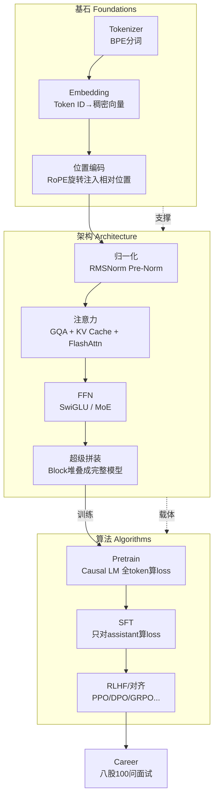
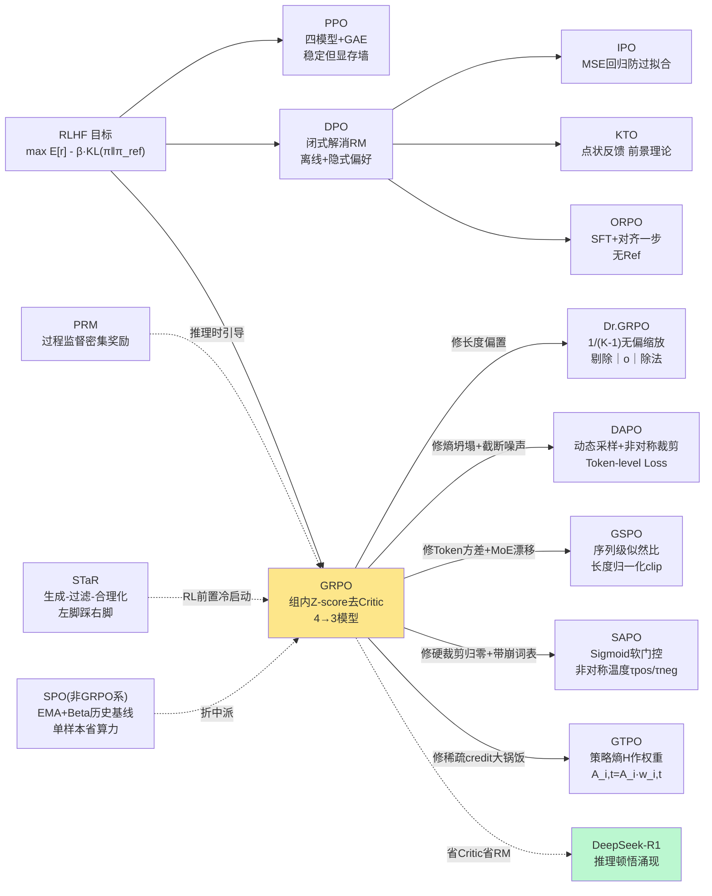

# From Minimind to More — 全篇结构化精读总图

> 本文档是对 [Tongyun1/from-minimind-to-more](https://github.com/Tongyun1/from-minimind-to-more) 全 17 篇正文(约 62 万字 / 1 万行)的逐篇精读合成。
> 每篇笔记独立成文于 `01_*.md` ~ `16_*.md`,本文是它们的**总索引 + 总思维导图 + 全局批判**。
> 阅读路径建议:先读本图建立全貌 → 按需精读单篇笔记 → 回本图查交叉关系。

---

## 一、项目定位(一句话)

这是基于 [minimind](https://github.com/jingyaogong/minimind)(一个 26M 的"从零训练 LLM"项目)的**中文超详细学习笔记 + 源码逐行注释 + LLM 求职面试题库**;以 minimind 为骨架,把 Tokenizer → 架构 → 训练算法 → 对齐 → 求职 一条龙讲透,目标读者是"想真正看懂一个从零实现的 LLM、同时备战大模型岗面试"的人。

**关键事实**:minimind 是**极小体量(26M)却对齐 Llama3/DeepSeek-V2 前沿设计**的"现代 LLM 特性博物馆"——Decoder-Only + RoPE/YaRN + GQA + Flash Attention + RMSNorm(Pre-Norm) + SwiGLU + 混合 MoE(DeepSeek 式 Shared+Routed) + Weight Tying。理解这一个 Block,就等于理解了 Llama3 / Qwen2 / DeepSeek 的核心运作机制。

---

## 二、全篇知识总思维导图

```mermaid
mindmap
  root((From Minimind<br/>to More))
    基石篇 Foundations
      Tokenizer
        BPE 频率合并自底向上
        WordPiece PMI似然度
        Unigram EM+Viterbi剪枝
        字节级BPE消灭OOV
        bytes_to_unicode 空格→Ġ
        特殊Token正则抠出
        Glitch Tokens 未训练Embedding
      Minimind设计目录
        Decoder-Only Causal Mask
        GQA Q头8/KV头2
        RoPE+YaRN 长上下文外推
        Pre-Norm RMSNorm
        SwiGLU FFN
        Hybrid MoE Shared+Routed
        Weight Tying+词表6400
      Embedding与位置编码
        分布语义 Token Embedding
        正弦APE 多尺度时钟
        ALiBi 线性衰减外推之王
        RoPE 复数旋转 只剩m-n
        PI/NTK/YaRN 频域外推4k→128k
        M-RoPE 多模态时空
        DeepSeek解耦RoPE
    架构篇 Architecture
      归一化技术
        BN→LN→RMSNorm
        Pre-Norm vs Post-Norm
        DeepNorm 1000层有界更新
        QK-Norm 治熵坍塌
        Sandwich/NormFormer
      KVCache与FlashAttn
        "KV Cache 空间换时间 O(L²)→O(L)"
        MHA→MQA→GQA→MLA
        FlashAttention Tiling IO感知
        FlashDecoding Split-K
        PagedAttention 显存分页
        Prefill计算墙/Decode存储墙
      MoE混合专家
        稀疏激活 总参vs激活参
        Top-K路由 可微性陷阱
        专家坍缩 负载均衡
        aux loss传统 vs 无aux动态偏置
        细粒度专家+共享专家
        EP专家并行 All-to-All
        FP8混合精度
      超级拼装
        MiniMindConfig五切片
        Block Pre-Norm双残差
        数据流逐层张量形状
        logits_to_keep切片
        总loss=CE+α·aux
      推理训练优化机制
        六大支柱协同
        Continuous Batching
        投机解码 Medusa/EAGLE/MTP
        MoE/Mamba线性化
        量化 GPTQ/AWQ/SmoothQuant/FP8
    算法篇 Algorithms
      RL概览
        MDP/策略/价值/优势
        RLHF三阶段 SFT→RM→PPO
        演进主线 去Critic去RM粒度精细
        TRPO信任区域 二阶海森
        PPO Clipped 一阶工业标准
        ReMax/RLOO/Reinforce++ 去Critic
        DPO/IPO/KTO/ORPO RL-Free隐式偏好
        GRPO系 组内Z-score+规则奖励
        PRM过程监督/STaR自举
      Pretrain
        Causal LM 下一词预测
        指令数据当pretrain
        Loss Masking Pretrain全算/SFT只assistant
        Cosine LR 无warmup
        梯度累积/裁剪/混合精度
        原子化断点续训
        DDP ignore RoPE
      SFT
        chat template压扁多轮
        generate_labels 只assistant算loss
        Shift Prediction错位
        full SFT vs LoRA
        过拟合控制 epoch少lr小
      DPO
        闭式解 r=β·log(π/π_ref)
        Bradley-Terry消去Z(x)
        双模型前向 policy+ref
        长度归一化 sum vs mean
        β控制KL偏离 lr极小4e-8
      PPO
        四模型 Actor/OldActor/Ref/Critic
        One-step MDP 极简无GAE
        三loss policy_clip+value_mse+kl_ref
        ratio句子级 vs token级
        KL k3估计可能非负不保证
        两次padding 采样不算logp
      GRPO及变体
        GRPO 组内Z-score去Critic
        Dr.GRPO 修长度偏置1/(K-1)
        DAPO 动态采样+非对称裁剪
        GSPO 序列级似然比稳MoE
        SAPO 软门控+非对称温度
        GTPO 熵加权token级credit
      SPO
        AutoAdaptiveValueTracker
        EMA+Beta分布历史基线
        KL半衰期动态动量ρ
        单样本省算力 vs GRPO多样本
        序列级优势广播token
    求职篇 Career
      八股100问
        7板块纯题目无答案
        架构20/预训练15/微调15/对齐15/推理13/RAG12
        导览索引非教材
        部分考点2026已过时
```

---

## 三、核心主线:从基石到对齐的完整训练链路

整本笔记串起来就是**一个 LLM 从零到对齐的完整生命周期**,按数据流:



---

## 四、各篇一句话索引

| # | 篇名 | 一句话精炼 | 笔记文件 |
|---|------|-----------|----------|
| 01 | 基石:Tokenizer | 子词分词是连接自然语言与机器的桥梁,BPE 以频率合并为基石。 | [01_tokenizer.md](01_tokenizer.md) |
| 02 | 基石:Minimind设计目录 | 26M 小体量对齐 Llama3/DeepSeek-V2 前沿设计,一个 Block 即主流大模型技术栈缩影。 | [02_design.md](02_design.md) |
| 03 | 基石:Embedding与位置编码 | Embedding 度量意义,RoPE 用旋转诱导相对位置,YaRN 用频域插值把 4k 撑到 128k。 | [03_embedding_pos.md](03_embedding_pos.md) |
| 04 | 架构:归一化技术 | BN→LN→RMSNorm、Post→Pre 演进,本质是"梯度稳定性 vs 表达上限"的工程权衡。 | [04_norm.md](04_norm.md) |
| 05 | 架构:KVCache→FlashAttention | 推理瓶颈从算力转向显存带宽,KV Cache/GQA/FlashAttn 三维度驯服显存与计算复杂度。 | [05_kvcache_flashattn.md](05_kvcache_flashattn.md) |
| 06 | 架构:MoE混合专家 | 稀疏激活解耦总参数量与激活参数量,DeepSeek 式细粒度+共享+无aux 是后摩尔时代核心架构。 | [06_moe.md](06_moe.md) |
| 07 | 架构:超级拼装 | Llama 骨架 + DeepSeek 式 MoE + YaRN + Gemma 式 Tied Embedding 的小而全现代 LLM。 | [07_assemble.md](07_assemble.md) |
| 08 | 架构:推理训练优化机制 | Prefill 计算墙/Decode 存储墙下,六大支柱协同把显存折算成吞吐。 | [08_infer_train_opt.md](08_infer_train_opt.md) |
| 09 | 算法:RL算法概览 | 演进主线是"去 Critic、去显式 RM、粒度精细化",GRPO 家族以群体相对基线涌现顿悟。 | [09_rl_overview.md](09_rl_overview.md) |
| 10 | 算法:Pretrain | Causal LM 目标 + 一整套工程脚手架(余弦 LR/梯度累积/原子续训)在小显存稳训 LLM。 | [10_pretrain.md](10_pretrain.md) |
| 11 | 算法:SFT | 与 Pretrain 框架同构,灵魂在 Dataset 层:chat template 压扁 + Loss Masking 把续写机改造成助手。 | [11_sft.md](11_sft.md) |
| 12 | 算法:DPO | 用闭式解 r=β·log(π/π_ref) 跳过 RM/PPO,直接在 chosen/rejected 偏序对上做监督学习。 | [12_dpo.md](12_dpo.md) |
| 13 | 算法:PPO | 四模型压一卡 + One-step MDP 极简,用 ratio clip + KL + value MSE 三 loss 做 RLAIF 微调。 | [13_ppo.md](13_ppo.md) |
| 14 | 算法:GRPO及变体 | 组内 Z-score 去 Critic 省一个 LLM,催生 Dr.GRPO/DAPO/GSPO/SAPO/GTPO 一整条变体补丁链。 | [14_grpo.md](14_grpo.md) |
| 15 | 算法:SPO | EMA+Beta 分布追踪器替代 Critic,KL 半衰期动态动量实现单样本省算力的折中派。 | [15_spo.md](15_spo.md) |
| 16 | 求职:八股100问 | 7 板块 100 题纯列表无答案,定位是"复习提纲/自测索引",知识载体外置到 minimind+AI。 | [16_interview_100.md](16_interview_100.md) |

---

## 五、对齐算法谱系总图(全篇最核心)

GRPO 家族是整本笔记的技术前沿与求职热点,单列详图:



---

## 六、minimind 工程实现要点速查(跨篇共性)

多篇笔记反复出现的工程细节,汇成一张速查表(面试可直接用):

| 主题 | 关键实现 | 所在篇 |
|------|---------|--------|
| **RoPE** | `precompute_freqs_cis`(YaRN 的 inv_dim/ramp)+ `apply_rotary_pos_emb`(rotate_half 等价复数旋转) | 03/07 |
| **归一化** | RMSNorm:`rsqrt` 加速 + `float32` 计算 → `type_as` 回原精度(防 fp16 溢出) | 04 |
| **注意力** | GQA:`repeat_kv`(expand+reshape 复制 KV 头);Flash 仅 Prefill 无 cache 时走 SDPA | 05/07 |
| **MoE** | `MoEGate`(softmax+topk+norm);训练 `repeat_interleave`+`0*params` 防 DDP 死锁;推理 `argsort+bincount+scatter_add_` 跳空专家 | 06 |
| **Shift Prediction** | `logits[...,:-1,:] ↔ labels[...,1:]`,一次前向算所有 token loss | 07/10/11 |
| **Loss Masking** | Pretrain 只 mask pad(-100);SFT 只 assistant 段算 loss;DPO/PPO/GRPO/SPO 含 EOS | 10/11/12/13/14/15 |
| **梯度累积** | `loss / accumulation_steps`;等效 batch = batch×world_size×accum | 10/11/12/13/14/15 |
| **AMP 顺序** | `scaler.unscale_` → `clip_grad_norm_` → `scaler.step` → `update` → `zero_grad(set_to_none=True)` | 10/11/12/13 |
| **原子续训** | `lm_checkpoint`:写 `.tmp` → `os.replace`;含 model/opt/scaler/epoch/step/ws;GPU 数变化 `step×saved_ws//cur_ws` | 10 |
| **DDP ignore** | `_ddp_params_and_buffers_to_ignore={"freqs_cos","freqs_sin"}`(RoPE 表不参与梯度同步) | 10/11/12/13/14/15 |
| **保存剥壳** | DDP `.module` → compile `_orig_mod` → `.half().cpu()` → `torch.save` | 10/11/12/14/15 |
| **KL 估计** | GRPO/SPO 用 Schulman 正定形式 `exp(Δ)-Δ-1`;PPO 用 `k3` 近似 `(logp_a-logp_r).mean()`(可能为负) | 13/14/15 |
| **logps 抽取** | `log_softmax(logits[:,:-1]).gather(labels)` 错位切片取实际 token 概率 | 12/13/14/15 |

---

## 七、全局批判性批注(跨篇综合)

精读 16 篇后,提炼出该笔记/项目层面的**跨篇共性问题**:

### 7.1 作者层面的优点
- **源码级而非概念级**:对着 minimind 真实代码逐行讲,配 tensor shape 标注,不是空谈架构图。
- **前沿覆盖度罕见**:GRPO 五变体(Dr.GRPO/DAPO/GSPO/SAPO/GTPO)+ SPO + PRM/STaR 一条龙,中文 LLM 教学资料里属顶级。
- **写作有风格**:用通俗类比讲清算法动机(如"GRPO 像搞题海战术的小组学习")。
- **自我批判诚实**:作者明确承认 minimind 是极简教学实现,多处标注"未实现工业级 X"。

### 7.2 跨篇共性问题

**A. minimind 实现与工业标准的差距未充分量化**
- PPO 把整段 response 当 one-step MDP、句子级 ratio、KL 用可能为负的 k3 近似、无 advantage 标准化——这些都是与 TRL/标准 PPO 的**算法级**差异,作者虽标注"极简",但未量化效果差距,初学者易误以为"这就是 PPO"。
- DPO 用 mean(每 token 平均)而非原论文 sum(整句联合概率),改变了损失的概率语义,作者未点出这一偏离。
- GRPO/Minimind 把 reward 截断到 [-3,3] 是工程 hack 而非理论需要,会扭曲 RM 相对排序。

**B. 部分内容 2026 视角下已过时**
- 八股100问里 Chinchilla scaling law、经典 RLHF/DPO 叙事、MMLU 等老评测榜已被 over-training、RLVR/GRPO、MMLU-Pro/GPQA/AIME 等取代。
- 八股把 DPO/MoE/FlashAttn/vLLM 列为"加分项",但 2026 已属标配。
- 推理优化篇(08)未提 SGLang/LMDeploy、GGUF/AWQ 在 llama.cpp 生态的实际落地。

**C. 数学严谨性参差**
- RL 概览篇(09)的"RLOO 超越 PPO""KTO 匹敌 DPO"等声明缺定量基准。
- Dr.GRPO 的"1/(K-1) 无偏缩放"论证偏口语化,学术面试若被追问易露怯。
- SPO 的"不需要 clamp 也能稳定"与代码中 `advantages.clamp(-5,5)` 矛盾。

**D. 归因偏单一**
- 把 DeepSeek-V3 SOTA 归于"无 aux loss + 细粒度 + 共享专家",但 MLA/FP8/通信重叠/数据/RL 同样关键。
- 把 GRPO 描绘为 R1 推理涌现核心功臣,但未充分讨论基座规模、冷启动 SFT 等混杂变量。
- 个别处偏宣传化(SPO 的"创新性"、PRM 的"不可逾越护城河")。

**E. 覆盖盲区**
- 八股缺多模态专章、Agent 工程链路、长上下文新机制(NSA/MoBA/hybrid SSM)、安全/红队。
- 推理训练优化篇实际只覆盖推理,缺分布式训练(数据并行/ZeRO/TP/PP)、混合精度训练原理、梯度累积推导。
- 优化篇(LoRA/知识蒸馏)至今未写。

### 7.3 结论性判断
作为**中文 LLM 学习/求职参考**,该笔记质量**远高于平均水平**,核心价值在"源码逐行注释 + 前沿 GRPO 家族串讲 + 面试导向",在 minimind 教学生态里是扎实补充。短板是 minimind 极简实现与工业标准的差距未充分量化、部分内容时效性、数学严谨性参差。**建议读者带着"时间戳意识"和"教学 vs 生产"的区分读**,遇到关键论断回原论文交叉验证。

---

## 八、阅读路径推荐

按读者画像选路径:

**A. 纯新手(刚接触 LLM)**
02(设计目录)→ 01(Tokenizer)→ 03(Embedding/位置)→ 04(归一化)→ 07(超级拼装)→ 10(Pretrain)→ 11(SFT)→ 09(RL 概览)→ 16(八股)

**B. 求职冲刺(3 个月内面试)**
16(八股自测)→ 04/05/06(架构高频)→ 09(RL 概览+对比表)→ 12/13/14(DPO/PPO/GRPO)→ 速查表第六节

**C. 算法岗深度(SFT/RL 方向)**
09 → 12(DPO 推导)→ 14(GRPO 变体谱系)→ 15(SPO)→ 13(PPO 工程)→ 10/11(训练工程)

**D. 工程/推理部署岗**
05 → 08 → 06(MoE 部署)→ 07 → 速查表

---

## 九、笔记文件清单

```
/tmp/fmmtm_notes/
├── 00_OVERVIEW.md          ← 本文件(总图+索引)
├── 01_tokenizer.md
├── 02_design.md
├── 03_embedding_pos.md
├── 04_norm.md
├── 05_kvcache_flashattn.md
├── 06_moe.md
├── 07_assemble.md
├── 08_infer_train_opt.md
├── 09_rl_overview.md
├── 10_pretrain.md
├── 11_sft.md
├── 12_dpo.md
├── 13_ppo.md
├── 14_grpo.md
├── 15_spo.md
└── 16_interview_100.md
```

每篇均含固定八段:一句话精炼 / 核心概念 / 关键公式(LaTeX) / 关键算法流程 / 源码要点 / 作者独到见解类比 / 面试考点 / 批判性批注 / 篇内思维导图(mermaid 或缩进树)。
