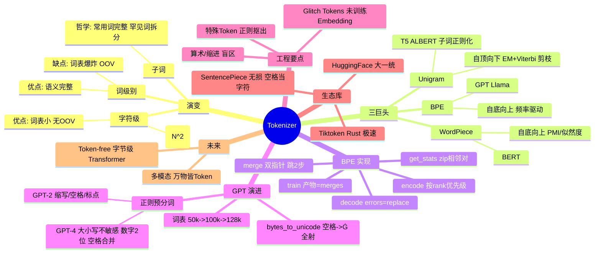

# 基石:Tokenizer 你所需要知道的一切

## 一句话精炼
子词分词是连接自然语言与机器的桥梁,BPE 以频率合并为基石。

## 核心概念
- **分词(Tokenization)** — 将连续文本流切分为离散 Token ID 序列,是 LLM 处理信息的第一道工序。
- **子词(Subword)** — 介于字符与词之间:常用词保持完整,罕见词拆为有意义的子部件,兼顾词汇覆盖率与序列长度。
- **OOV(未登录词)** — 词级别模型遇到词表外词时只能映射为 \<UNK>,信息丢失;字节级 BPE 理论上消灭 OOV。
- **BPE(Byte-Pair Encoding)** — 基于频率的迭代合并算法,本质是数据压缩,从字节出发逐步合并最高频相邻对。
- **WordPiece** — 与 BPE 同为自底向上,但选择标准为似然度增益(等价 PMI),而非频次。
- **Unigram** — 自顶向下,用 EM 算法+Viterbi 切分,从大词表剪枝到目标大小,支持概率采样增强。
- **预分词(Pre-tokenization)** — 用正则在 BPE 合并前把文本切成"单词块",禁止跨块合并,保护标点等语法边界。
- **字节级 BPE** — 初始 ids 为 UTF-8 字节流(0-255),保证可处理任意 Unicode/二进制,无 OOV。
- **bytes_to_unicode** — GPT-2 把不可见字节(如空格 0x20)双射映射到 256 之后的可见字符(如 Ġ),无损+可读+通用。
- **特殊 Token(Special Tokens)** — 如 \<|endoftext|>、\<|im_start|>,有独立语义,必须在 BPE 合并前用正则"抠出",否则会被切碎导致模型失能。
- **Glitch Tokens** — 词表中存在但 Embedding 从未训练到的 Token(如 SolidGoldMagikarp),推理触发随机向量导致输出崩坏。
- **Token 通胀** — 非英语(如中文)同等语义消耗更多 Token,大词表可缓解,关乎多语言公平性与成本。
- **merges 字典** — BPE 训练的核心产物,记录 (p0,p1) -> 新ID 的合并规则与优先级顺序,推理时按此顺序合并。

## 关键算法/流程

### BPE 训练(自底向上,频率驱动)
```
输入: text, vocab_size
1. ids = list(text.encode("utf-8"))   # 初始字节序列,范围 0-255
2. num_merges = vocab_size - 256
3. merges = {}
4. for i in [0, num_merges):
     stats = get_stats(ids)            # 统计所有相邻对频次
     if not stats: break
     pair = max(stats, key=stats.get)  # 选频次最高的对
     idx = 256 + i                     # 分配新 ID(256, 257, ...)
     ids = merge(ids, pair, idx)       # 全局贪婪替换
     merges[pair] = idx                # 记录规则与优先级
5. return merges                       # 关键产物
```

### BPE 推理编码(按训练优先级合并)
```
输入: text, merges
1. ids = list(text.encode("utf-8"))
2. while len(ids) >= 2:
     stats = get_stats(ids)
     pair_to_merge = None; min_rank = inf
     for pair in stats:
       if pair in merges and merges[pair] < min_rank:
         min_rank = merges[pair]        # rank=ID,越小优先级越高
         pair_to_merge = pair
     if pair_to_merge is None: break
     ids = merge(ids, pair_to_merge, min_rank)
3. return ids
```

### get_stats(相邻对统计)
```
counts = {}
for pair in zip(ids, ids[1:]):    # 巧妙的相邻对生成
    counts[pair] = counts.get(pair, 0) + 1
```

### merge(双指针贪婪替换)
```
newids = []; i = 0
while i < len(ids):
    if i < len(ids)-1 and ids[i]==pair[0] and ids[i+1]==pair[1]:
        newids.append(idx); i += 2     # 跳过被合并的两元素
    else:
        newids.append(ids[i]); i += 1
```

### WordPiece 训练
- 与 BPE 流程相同,但选择合并对的标准为 `Score(A,B) = P(AB)/(P(A)P(B))` 最大者(PMI)。
- 考虑子词独立概率,避免两个本该独立的高频词被误并。

### Unigram 训练(EM + 剪枝)
```
1. 初始化: 构建巨大词表(所有子串,几百万)
2. E-step: 用 Viterbi 求每句最优切分(最大化 ∏ P(x_i))
3. M-step: 重算每个子词概率 P(x_i)
4. 计算移除每个子词的似然损失 ΔL
5. 剪枝: 移除 ΔL 最小的 20%
6. 回到 2,直到词表缩到目标
```
- 支持 Subword Regularization:按概率采样多种切分做数据增强。

### 特殊 Token 处理(伪代码)
```
special_pattern = create_pattern(special_tokens.keys())
splits = re.split(special_pattern, text)   # 先把特殊串抠出
for part in splits:
    if part in special_tokens: append(id)
    else: extend(bpe_encode(part))         # 普通文本才走 BPE
```

## 关键公式

**WordPiece 评分(PMI):**
$$\text{Score}(A, B) = \frac{P(AB)}{P(A) \times P(B)}$$

**Unigram 句子似然:**
$$P(\mathbf{x}) = \prod_{i=1}^{m} P(x_i)$$

**Unigram 剪枝损失:**
$$\Delta L = L_{\text{new}} - L_{\text{old}}$$

## 源码要点

对照 `/tmp/fmmtm/src/BPE.py` 与文中 minbpe 逻辑:

- **merges 优先级靠插入顺序** — `BPE.py` 的 `self.merges = {}` 注释明确:Python 3.7+ 字典保持插入顺序,越早插入优先级越高(等价文中 `min_rank` 逻辑)。这是推理时"按训练优先级合并"的实现关键,不需要显式存 rank 字段。
- **tokenize 中的优先级遍历** — `BPE.py` 的 `tokenize` 不用 `min_rank`,而是直接 `for pair in self.merges: if pair in pairs: break`,利用字典有序性取第一个命中的最高优先级规则,与文中 `encode` 的 `min_rank` 写法是同一思想的两种实现。
- **_merge 双指针逻辑** — `i` 从 0 扫到 `len(tokens)`,命中 pair 时 `append(new_token)` 并 `i += 2`(跳过两个被合并元素),否则 `i += 1`。条件 `i < len(tokens) - 1` 防止 `tokens[i+1]` 越界。文中 `merge` 完全一致。
- **贪婪全局替换** — `_merge` 对当前序列中所有出现的 pair 一次性替换,无回溯,对应文中"BPE 是贪婪的"。
- **train 的核心产物是 merges 而非 tokens** — `BPE.py` 训练结束只返回隐含的 `self.merges`,与文中"训练后最重要的产物是 merges 字典"一致;`merges.txt`/`tokenizer.json` 存的就是它。
- **初始单元差异** — `BPE.py` 用 `list(text)`(字符级)做教学简化,真实 LLM 用 `list(text.encode("utf-8"))`(字节级),文中明确指出这一点。
- **新 ID 分配** — 文中 `idx = 256 + i`,基础词表 0-255,第一次合并得 256;`BPE.py` 用字符串拼接 `new_token = best_pair[0] + best_pair[1]` 做教学演示,真实实现分配整数 ID。
- **确定性/Tie-breaking** — 文中指出 Python `max` 在值相同时返回先遇到的键,工业级实现需按字典序 tie-break 以保证可复现;`BPE.py` 同样依赖 `max(counts, key=counts.get)`,未做 tie-break,属教学实现的弱点。
- **MiniMind 工程实践** — 文末代码用 HuggingFace `tokenizers` 库:ByteLevel 预分词 + BpeTrainer,`vocab_size=6400`,`initial_alphabet=ByteLevel.alphabet()`(256 字节),用 `assert` 强制特殊 Token ID 顺序(endoftext=0, im_start=1, im_end=2),并配 `chat_template`(Jinja2)做多轮对话格式化。

## 作者独到见解/类比

- "连接人类认知与机器智能的桥梁"/"窥探大语言模型认知世界的第一眼" — 把 Tokenizer 定位为模型"看世界的第一眼",这一眼决定模型能看多远。
- "常用词保持完整,罕见词拆分为有意义的子部件" — 子词哲学的辩证统一表述。
- 空格的"可视化外衣" — `bytes_to_unicode` 把不可见字节穿上可见外衣(Ġ),既是显示特效更是数据层实质改变。
- "Unigram 不仅仅是一个分词器,它本身就是一个微型的语言模型" — 点出 Unigram 概率性带来的子词正则化能力。
- "Tokenizer 不仅仅是数据的搬运工,它实际上重塑了模型眼中的世界" — 许多 LLM 怪异行为(算术盲区、Glitch Tokens)都可追溯到分词阶段。
- "Raw stream in, Token stream out" — 概括 SentencePiece 的设计理念。

## 面试考点

文中明确提到的:
- BPE 训练与编码的**核心逻辑**(get_stats / merge / train 主循环)。
- 推理时**必须按训练优先级合并**,而非每次找当前最高频对(常见错误)。
- BPE / WordPiece / Unigram **三者区别**(方向、指标、确定性、OOV、适用场景)。
- WordPiece 用 **PMI/似然度**而非频次,为什么比频次更优(防止两个独立高频词被误并)。
- GPT-2 vs GPT-4 **正则改进**(大小写不敏感 `(?i:)`、数字 `p{N}{2,}`、连续空格合并利于 Python 缩进)。
- `bytes_to_unicode` 的**全射映射**与空格→Ġ 的意义。
- 特殊 Token 不能走普通 BPE 的原因与 Tiktoken `allowed_special` 安全机制(Prompt 注入防御)。
- 词表大小的**权衡**(太小序列长,太大 Embedding 稀疏难训练)。

推断的高频考点:
- 手写 BPE 的 `get_stats`/`merge` 伪代码(zip 相邻对、双指针越界检查)。
- 为什么字节级 BPE 消灭 OOV(任何 Unicode 都是字节)。
- merges 字典有序性如何编码优先级(Python 3.7+ 字典保插入顺序)。
- 解码时 `errors="replace"` 的必要性(不完整 UTF-8 字节序列,如 max_tokens 截断中文)。
- Glitch Token 成因(词表在但 Embedding 未训练)。
- SentencePiece 把空格当普通字符(_)实现无损可逆。
- Token 通胀对多语言公平性与成本的影响。
- Token-free / Byte-level Transformer(MegaByte, MambaByte)为未来方向。

## 批判性批注

- **事实性**:整体准确。一处需补正:文中称 GPT-4 cl100k_base 词表"约 100,277"并对 GPT-2"50,257"作"翻倍"描述,数值大致正确,但"翻倍"为约数,实际 50257→100277 接近但不严格 2 倍;不影响结论。
- **覆盖面**:对 BPE 讲解透彻,WordPiece/Unigram 偏概念性,缺 Unigram 的 Viterbi 实现细节与 EM 收敛性讨论;对 Tiktoken/HF/SentencePiece 三库对比偏宏观,未涉及实际 API 差异示例。
- **时效性**:文中主要覆盖到 GPT-4/Llama 3,对未来方向(Token-free、多模态)为展望性陈述;截止 2026 年,字节级模型与多模态 Tokenizer 已有实质进展,此节略陈旧但不构成错误。
- **代码一致性**:`BPE.py` 用字符级 `list(text)` 做教学简化,与文中强调的"真实 BPE 用字节级"存在教学 vs 生产差异,文中已显式标注,非缺陷。
- **小瑕疵**:文中部分正则片段在 Markdown 渲染下可能丢失反斜杠(如 `?p{L}+` 实为 `\p{L}+` 的转义丢失),阅读时需脑补;不影响理解。
- 总体未发现明显事实性错误。

## 篇内小思维导图


