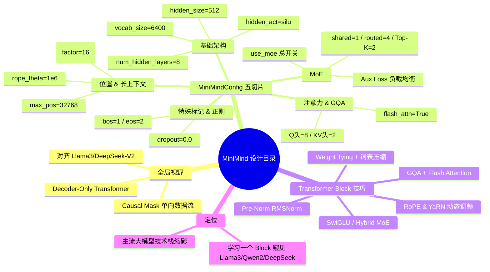

# 基石:Minimind 的设计目录

## 一句话精炼

MiniMind 用 26M 的极小体量对齐 Llama 3 / DeepSeek-V2 的前沿设计（Decoder-Only + RoPE/YaRN + GQA + Flash Attention + SwiGLU + 混合 MoE + Weight Tying），把一个 Transformer Block 变成了当代主流大模型技术栈的缩影。

## 核心概念

- **Decoder-Only Transformer** — 模型只保留解码器栈，核心任务是 Next Token Prediction，通过 Causal Mask 让当前 Token 只能看到过去、看不到未来，数据流单向。
- **MiniMindConfig** — 一切代码的起点配置类，继承自 HuggingFace 的 `PretrainedConfig`，用 `model_type="minimind"` 让库自动识别模型结构。
- **GQA（分组查询注意力）** — Query 头数（8）多于 KV 头数（2），多组 Q 头共享一组 KV 头，显著压缩 KV Cache 显存占用、加速推理。
- **Flash Attention** — 硬件级注意力加速算子，代码层自动适配 PyTorch 的 `F.scaled_dot_product_attention`，按环境自动开启，同时省显存、提速度。
- **RoPE（旋转位置编码）** — 用旋转矩阵把位置信息编码进 Q/K，`rope_theta=1e6` 高基频减缓远距离衰减，利于长文本。
- **YaRN（Yet another RoPE extensioN）** — 推理时长度外推算法，通过 `ramp` 函数动态调整频率，让"训练短、推理长"成为可能（如从 2k 外推至 32k）。
- **Pre-Norm RMSNorm** — 去掉 LayerNorm 的中心化、只保留缩放，且采用 Pre-Norm 结构，显著提升深层网络训练稳定性与收敛速度。
- **SwiGLU** — FFN 使用 SiLU 激活的 GLU 门控机制，非线性表达强于 ReLU，是当前主流大模型 FFN 的标配。
- **Hybrid MoE（混合专家）** — DeepSeek-MoE 式架构，`n_shared_experts`（共享专家，必经，负责通用知识）+ `n_routed_experts`（路由专家，Top-K 激活，负责垂类知识），配合 Aux Loss 负载均衡。
- **Weight Tying（权重绑定）** — `embed_tokens.weight = lm_head.weight`，输入 Embedding 与输出 Head 共享参数，在小模型里减少冗余、让参数预算用在刀刃上。
- **Vocab Compression（词表压缩）** — 词表仅 6400（主流模型 32k–100k），对微型模型/特定领域任务量身定做。
- **Aux Loss（辅助损失）** — 负载均衡惩罚项（`aux_loss_alpha=0.01`），防止 Router 坍塌到几个专家，强制所有专家"忙起来"；`seq_aux=True` 表示在序列级而非单 Token 级统计。

## 整体架构/模块组成（MiniMind 的目录结构与各模块职责）

源码入口在 `model/model_minimind.py`，由 `MiniMindConfig` 驱动整个模型结构：

```text
MiniMindForCausalLM
├── MiniMindConfig           # 配置总控（继承 PretrainedConfig，model_type="minimind"）
│   ├── 基础架构参数         # vocab_size=6400, hidden_size=512, num_hidden_layers=8,
│   │                       # intermediate_size=None(自动算), hidden_act='silu',
│   │                       # rms_norm_eps=1e-05 —— 决定模型的"宽度/深度/基本处理能力"
│   ├── 注意力 & GQA         # num_attention_heads=8(Q头), num_key_value_heads=2(KV头→GQA),
│   │                       # flash_attn=True —— 决定 Token 间关联如何处理
│   ├── 位置编码 & 长上下文  # max_position_embeddings=32768, rope_theta=1e6,
│   │                       # inference_rope_scaling=False(开启则 YaRN 外推) —— 决定序列长度能力
│   ├── MoE 配置            # use_moe(总开关), num_experts_per_tok=2(Top-K),
│   │                       # n_routed_experts=4, n_shared_experts=1,
│   │                       # scoring_func='softmax', aux_loss_alpha=0.01,
│   │                       # seq_aux=True, norm_topk_prob=True —— 决定是否走混合专家
│   └── 特殊标记 & 正则化   # bos_token_id=1, eos_token_id=2, dropout=0.0
│
└── Transformer Block 堆叠 ×8（num_hidden_layers）
    ├── Pre-Norm RMSNorm      # 归一化（去中心化 + Pre-Norm）
    ├── Attention 层          # GQA + Flash Attention（自动适配 SDPA）
    │   └── 位置注入: RoPE + YaRN（动态频率 ramp，推理时外推）
    ├── Pre-Norm RMSNorm
    └── FFN 层
        ├── Dense 模式        # SwiGLU（GLU 门控 + SiLU 激活）
        └── MoE 模式(use_moe=True)
            ├── n_shared_experts ×1   # 共享专家，所有 Token 必经，通用知识
            ├── n_routed_experts ×4  # 路由专家，Top-K=2 激活，垂类知识
            └── Router + Aux Loss    # softmax 门控 + 序列级负载均衡损失
│
└── 输出头: lm_head（与 embed_tokens 权重绑定，Weight Tying）
```

## 关键设计决策

1. **架构对齐而非一味求小**：26M 参数却全面对齐 Llama 3 / DeepSeek-V2 规范，不为极致小而牺牲架构先进性 —— 用小体量承载前沿设计，便于学习者理解主流大模型核心机制。
2. **选择 Decoder-Only 而非 Encoder-Only / Encoder-Decoder**：核心任务是 Next Token Prediction，Causal Mask 保证单向数据流，契合生成式任务范式。
3. **GQA 取代 MHA**：8 个 Q 头共享 2 组 KV 头（4:1），在显存与计算之间取平衡，KV Cache 显著压缩。
4. **Flash Attention 自动适配**：不写死，而是根据环境自动走 `F.scaled_dot_product_attention`，显存与速度双重优化。
5. **RoPE + YaRN 双层位置方案**：标准 RoPE 负责训练长度，YaRN 通过 `ramp` 动态调频在推理时外推（factor=16，2k→32k），实现"训练短、推理长"。
6. **Pre-Norm RMSNorm 替代 LayerNorm**：去掉中心化、只留缩放，Pre-Norm 结构保障深层（8 层堆叠）稳定收敛。
7. **SwiGLU 替代 ReLU-FFN**：GLU 门控 + SiLU 激活，更强的非线性表达。
8. **Hybrid MoE（DeepSeek-MoE 式）**：共享专家（通用知识，必经）+ 路由专家（垂类知识，Top-K），用 Aux Loss + `norm_topk_prob` 防坍塌、保数值稳定。
9. **Weight Tying + 词表压缩到 6400**：输入 Embedding 与 lm_head 共享权重，词表从 32k–100k 压到 6400，把每一分参数预算用在"刀刃上"，适配微型模型规模。
10. **dropout=0.0**：预训练阶段为最大化数据拟合能力，关闭 dropout，反映现代大模型预训练的常规取舍。

## 作者独到见解/类比

- **"麻雀虽小，五脏俱全"** —— 用最小 26M 参数的小麻雀，承载前沿大模型的五脏架构，强调"小而不残"。
- **"理解了这个 Block，你就理解了 Llama 3、Qwen 2 以及 DeepSeek"** —— 把 MiniMind 定位为当代主流大模型技术栈的"缩影/骨架"，学习一个 Block 即可窥见巨型模型的核心运作机制。
- **"共享专家负责通用知识，路由专家负责垂类知识"** —— 用职责分工的类比解释 DeepSeek-MoE 架构中两类专家的分工，直观。
- **"训练短，推理长"** —— 用对仗句式概括 YaRN 外推策略的核心价值。
- **"每一分参数预算都用在刀刃上"** —— 以"刀刃"比喻 Weight Tying + 词表压缩在小模型中的参数经济学。
- **把配置表切成五大切片（基础架构 / 注意力 & GQA / 位置与长上下文 / MoE / 特殊标记）** —— 用结构化切片让读者从"配置即设计"的视角理解模型，而非平铺参数。

## 面试考点

1. **Decoder-Only 与 BERT/T5 的区别**：数据流单向、Causal Mask、Next Token Prediction 任务定义。
2. **GQA 原理与收益**：Q 头多于 KV 头、共享 KV、KV Cache 显存压缩比例（4:1）、与 MHA/MQA 的关系。
3. **RoPE 的数学直觉与 `rope_theta` 的作用**：旋转位置编码为何能编码相对位置；高 theta 为何利于长文本、减缓远距离衰减。
4. **YaRN 外推机制**：`ramp` 动态调频、factor=16、训练 2k 推理 32k 的可行性边界与代价。
5. **Pre-Norm vs Post-Norm、RMSNorm vs LayerNorm**：去中心化、缩放、深层稳定性与收敛速度。
6. **SwiGLU 的结构与增益**：GLU 门控 + SiLU、相比 ReLU-FFN 的表达力提升、intermediate_size 的放大比例。
7. **Hybrid MoE 架构**：共享专家与路由专家的职责分工、Top-K=2 路由、softmax 评分、`norm_topk_prob` 归一化的数值稳定性意义。
8. **Aux Loss 负载均衡**：为何需要（防专家坍塌）、`aux_loss_alpha` 调参、`seq_aux` 序列级 vs Token 级的差异。
9. **Weight Tying 的动机与边界**：输入 Embedding 与 lm_head 共享、为何在小模型尤其重要、大模型是否仍适用。
10. **词表压缩到 6400 的取舍**：对训练效率、多语言能力、领域适配的影响。
11. **Flash Attention 自动适配**：为何不写死、`F.scaled_dot_product_attention` 的回退机制、显存与速度双重收益。
12. **dropout=0.0 的现代预训练取舍**：数据拟合最大化 vs 过拟合风险。

## 批判性批注

- **"最小 26M"与配置表不完全自洽**：`hidden_size=512`、`num_hidden_layers=8`、`intermediate_size` 默认自动算（通常 4 倍即 ~2048）的稠密配置，粗算参数量已远超 26M（仅 embedding+layers 即数十 M），26M 更可能是"最小可用配置"或包含权重绑定/词表压缩后的净参数，文中未给出明确核算口径，需读者警惕口径差异。
- **YaRN "训练 2k、推理 32k" 的代价被淡化**：外推能跑≠外推无损，长文本泛化质量、幻觉率、远距离注意力退化均未讨论，应作为"可用但有损"理解，而非免费午餐。
- **MoE 默认关闭（`use_moe=False`）**：文中大篇幅强调混合专家先进性，但默认仍是稠密模型；MoE 路径的真实收益需在开启后对比，稠密基线下的"参数利用率"论断需谨慎。
- **`n_routed_experts=4`、`num_experts_per_tok=2`** 规模过小，无法充分体现 MoE 的稀疏激活红利，更接近教学演示而非工程实践，迁移到真实大模型时不能直接照搬比例。
- **Weight Tying 在极小词表（6400）下的收益**：词表本已极小，权重绑定的"减少冗余"边际收益相对有限，文中"每一分参数预算都用在刀刃上"的说法略有夸大。
- **架构先进性 vs 实际效果**：作者强调"五脏俱全、对齐前沿"，但未提供与同体量基线（如关闭 GQA/YaRN/MoE 的 ablation）的对比数据，先进性是否在小规模下真正转化为效果提升，缺乏证据闭环。
- **"理解这个 Block 就理解 Llama 3/Qwen 2/DeepSeek"**：作为学习类比可成立，但巨型模型在工程化（张量并行、流水并行、上下文并行、KV 量化、蒸馏）上的复杂度远超 MiniMind，类比有简化失真风险。
- **配置表 `intermediate_size=None` 的自动计算**：文中用"通常"措辞，未点明具体计算规则（4× hidden_size 是约定俗成但非强制），对初学者可能造成"黑盒"误解。

## 篇内小思维导图

