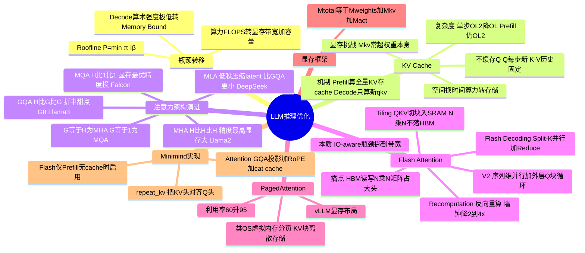

# 架构:大模型优化方法(KV Cache → Flash Attention)

## 一句话精炼

LLM 推理瓶颈已从算力(FLOPS)转向显存带宽与容量,KV Cache 用空间换时间消除自回归冗余计算,GQA/MQA 压缩 KV 头数降显存,Flash Attention 用 IO 感知的分块融合 kernel 打破注意力二次方存储瓶颈——三者分别从"算力→存储""精度→效率""计算→IO"三个维度系统性驯服了显存与计算的复杂度。

## 核心概念

### KV Cache(键值缓存)
- 以空间换时间,消除自回归生成中的冗余计算
- Prefill 阶段:计算 Prompt 所有 Token 的 K、V 并存入显存
- Decode 阶段:每生成一个新 Token 只计算当前 q_n、k_n、v_n,将 k_n/v_n 追加到 cache 末尾,注意力变为 q_n 与 (K_cache + k_n) 的交互
- 把计算复杂度从 O(L²) 降到 O(L)(线性扫描历史)
- 为什么只缓存 K、V 不缓存 Q:Query 代表"当前关注点",每步都是全新的;历史 Token 作为被关注对象(K)和信息载体(V)特征固定,可缓存

### KV Cache 显存公式
$$M_{KV} = 2 \times N_{layers} \times N_{heads} \times D_{head} \times L_{seq} \times B_{batch} \times P_{size}$$
- 系数"2"代表同时存 Key 和 Value
- 随 Batch Size、Sequence Length 增长,KV Cache 体积常超过模型权重本身,成为并发量主瓶颈

### 注意力架构演进(MHA → MQA → GQA)
- **MHA(Multi-Head Attention)**:Q:K:V = H:H:H,每个 Query 头有专属 K/V 空间,精度最高但显存压力大。代表:GPT-3、Llama 1/2 (7B/13B)
- **MQA(Multi-Query Attention)**:Q:K:V = H:1:1,所有 Query 头共享同一 K/V 头,KV Cache 缩小 H 倍,但精度损失明显、训练不稳定。代表:Falcon、PaLM
- **GQA(Grouped-Query Attention)**:Q:K:V = H:G:G,Query 头分 G 组,每组共享一个 K/V 头;G=H 退化为 MHA,G=1 退化为 MQA,甜点 G=8。精度接近 MHA、速度接近 MQA,可通过 Up-training 从 MHA 平滑升级。代表:Llama 2 70B、Llama 3 全系、Mistral、DeepSeek

### Flash Attention(IO 感知优化)
- GPU 显存层级:SRAM(19TB/s+,100-200KB/SM)极快极小;HBM(2-3TB/s,40-80GB)较慢较大
- 标准 Attention 痛点:S=QKᵀ 的 N×N 矩阵要写入 HBM,再读回做 Softmax,再写回,再读 P、V 算 O——频繁 HBM 读写占大头时间
- **Tiling(分块)**:把 Q、K、V 切成能放入 SRAM 的小块,在 SRAM 内完成乘法与 Softmax;利用 Softmax 数学性质动态更新归一化因子,无需访问全量矩阵;N×N 注意力矩阵从未完整写入 HBM
- **Recomputation(重计算)**:反向传播时不存注意力矩阵,重算一遍前向;FLOPs 增加但 HBM 访问大减,总墙钟时间反而缩短 2-4 倍
- **V2 改进**:增加序列长度维度并行;外层循环改为在 Query 块上迭代 K/V 块,减少 HBM 同步开销
- **Flash Decoding(推理专用)**:针对 Decoding 阶段 Query 长度=1、GPU 利用率低的问题,用 Split-K 把长 KV Cache 切成多块,多 CUDA Thread Block 并行算,最后 Reduce 合并;长上下文(32k+)可提速 8 倍以上

### PagedAttention(vLLM)
- 类似操作系统虚拟内存分页,允许 KV Block 离散存储,解决物理连续存储的碎片化
- 显存利用率从 60% 提升到 95%+,与 GQA 组成现代推理栈标配

### MLA(Multi-Head Latent Attention,DeepSeek-V2/V3)
- 通过低秩矩阵分解把 K、V 压缩为极小的 Latent Vector
- 与 GQA 不同:GQA 减少头数,MLA 压缩每个头内部数据表示
- DeepSeek-V2(236B)的 KV Cache 比 Llama 3 70B(GQA)还小

## 关键公式

### Roofline 模型(算术强度与内存墙)
$$P = \min(\pi, I \times \beta)$$
- P:计算性能上限;π:峰值算力;I:算术强度(FLOPs/Byte);β:峰值内存带宽
- Prefill:高算术强度,Compute Bound;Decode:算术强度极低(每 Token 加载全部权重只做一次 GEMV),Memory Bound

### 推理速度上限
$$\text{Speed} = \frac{\beta}{M_{weights}} = \frac{3350 \text{ GB/s}}{140 \text{ GB}} \approx 24 \text{ Tokens/s}$$
(70B FP16 在 H100 上,与 Batch Size 无关)

### 缩放点积注意力
$$\text{Attention}(Q, K, V) = \text{softmax}\left(\frac{QK^T}{\sqrt{d_k}}\right)V$$
- 时间复杂度 O(L²)、空间复杂度 O(L²)

### KV Cache 显存
$$M_{kv\_cache} = 2 \times N_{layers} \times N_{kv} \times D_{head} \times L_{seq} \times B \times S_{prec}$$

### 总显存
$$M_{total} = M_{weights} + M_{kv\_cache} + M_{activation}$$
$$M_{weights} \approx P_{model} \times S_{prec}$$

### IO 耗时(长上下文带宽瓶颈)
$$T_{io} = \frac{\text{数据量}}{\text{带宽}} = \frac{16 \text{ GB}}{1000 \text{ GB/s}} = 16 \text{ ms}$$
(Llama 3 8B 128k 在 4090 上每生成一个 Token 光读 KV 就要 16ms)

### FlashAttention IO 复杂度
标准 Attention 的 HBM 访问为 O(N²)(读写 N×N 矩阵),FlashAttention 通过 tiling 降为 O(N²d²/M)(M 为 SRAM 大小,实际远小于 N²),这是其"快在 IO 而非计算"的本质。

## 关键算法/流程

### FlashAttention 的 Tiling 逻辑
1. 把 Q、K、V 矩阵按块切分,块大小适配 SRAM 容量
2. 外层循环遍历 Q 块(V2:固定 Q 块,遍历 K/V 块以减少同步),内层遍历 K/V 块
3. 在 SRAM 内完成 Q_block @ K_blockᵀ,得到局部分数
4. 利用 Softmax 的"最大值减、指数、归一化因子动态更新"性质,逐块累积正确的归一化统计量,无需看全量 N×N 矩阵即可得到正确的全局 Softmax
5. 局部输出累加进 O,最终只把 N×d 的结果写回 HBM
6. 反向传播时重算前向(不存中间注意力矩阵)

### KV Cache 复用机制
1. 首 Token 生成(Prefill):计算 Prompt 全部 K、V 存入 cache
2. 生成第 n 个 Token:只算当前 q_n、k_n、v_n
3. 拼接:k_n、v_n 追加到 cache 末尾 → K_cache、V_cache 长度+1
4. 注意力:q_n 与 (K_cache 拼接后的全量 K) 交互,得到下一个 Token
5. 循环直到 EOS

### Flash Decoding 流程
1. Split-K:长 KV Cache 切成多个 chunks
2. 多 CUDA Thread Block 并行算 Query 与各 chunk 的注意力分数
3. Reduce:合并各 chunk 结果
4. 充分利用所有 SM,避免核心空转

## 源码要点(Minimind 实现)

文件:`model/model_minimind.py` 的 `Attention` 类与 `repeat_kv` 函数

### repeat_kv(x, n_rep)
- 实现 GQA 的 KV 头重复:`[B, L, num_kv_heads, head_dim]` → `[B, L, num_heads, head_dim]`
- 用 `x[:, :, :, None, :]` 插轴 → `.expand(...)` 广播 → `.reshape(...)` 合并
- n_rep = num_heads / num_kv_heads;n_rep==1 时直接返回(MHA 情况)

### Attention.__init__
- GQA 配置:`num_key_value_heads` 可独立配置;断言 `num_attention_heads % num_key_value_heads == 0`
- 投影层:`q_proj` 输出 num_heads*head_dim,`k_proj`/`v_proj` 输出 num_kv_heads*head_dim(更小)
- Flash 检测:`self.flash = hasattr(F, 'scaled_dot_product_attention') and args.flash_attn`(依赖 PyTorch 2.0+)

### forward 五步
1. **Q/K/V 投影 + reshape**:`xq/xk/xv` reshape 为多头,K、V 用 KV 头数(GQA 关键)
2. **RoPE**:对 Q、K 应用旋转位置编码(`apply_rotary_pos_emb`)
3. **KV Cache 拼接**:`past_key_value is not None` 时在 dim=1(序列维)上 `torch.cat` 历史与当前 K、V;`use_cache=True` 返回 `(xk, xv)` 作新 cache
4. **GQA 处理**:`repeat_kv(xk, n_rep)`、`repeat_kv(xv, n_rep)` 把 KV 头数对齐到 Query 头数,再 transpose 到 `[B, num_heads, seq_len, head_dim]`
5. **注意力计算**:
   - Flash 分支(条件:`seq_len > 1` 且无 past_key_value 且 mask 全 1):`F.scaled_dot_product_attention(xq, xk, xv, is_causal=True)` 自动因果掩码
   - 标准分支:`scores = (xq @ xk.transpose(-2,-1)) / sqrt(d_k)`;`triu(-inf, diagonal=1)` 加因果掩码;加 attention_mask(`0→-1e9`);softmax;dropout;`scores @ xv`
6. **输出投影**:transpose+reshape 回 `[B, L, num_heads*head_dim]`,`o_proj` + resid_dropout

### 关键设计点
- Flash 仅在训练/Prefill、无 cache、无复杂 mask 时启用;Decoding 走标准分支(因 Query 长度=1,SDPA 优势不明显)
- KV Cache 用简单 tuple 传递,未做 PagedAttention 式分页(教学实现)
- 因果掩码只作用于"当前序列部分"(`scores[:, :, :, -seq_len:]`),因历史部分已被 cache 遮蔽过

## 作者独到见解/类比

1. **"算力瓶颈 → 显存带宽/容量瓶颈"的范式转移**:训练阶段 FLOPS 是瓶颈,推理阶段(尤其 Decode)算术强度极低,完全受限于显存带宽。70B FP16 在 H100 上理论 24 Tokens/s,与 Batch Size 无关——内存墙是根本物理障碍
2. **"为什么不缓存 Q"的直觉解释**:Query 是"当前关注点",每步新生成位置都在变;K、V 是被关注的对象和信息载体,历史固定可缓存。这把抽象的"为什么是 KV"讲清楚了
3. **GQA 是 MHA 与 MQA 的泛化**:G=H 是 MHA,G=1 是 MQA,G=8 是甜点。把三者统一成一个连续谱,而非三个割裂方案
4. **Flash Attention 的反直觉**:重计算增加 FLOPs 反而更快——因为瓶颈不是计算而是 IO,墙钟时间由 HBM 访问主导。这是把"IO-Aware"讲透的核心一击
5. **"吸管喝水"类比 Flash Decoding**:128k 不优化时 GPU 像一根吸管(单线程)吸 16GB 水;Flash Decoding 把水切成块分发给所有 SM 同时吸,虽不减水量但提升并行度
6. **"大桶装权重"类比显存预算**:显存是大桶,先装模型权重(雷打不动),剩下的空间才能服务用户存 KV——决定了 max batch
7. **三层优化的分工**:GQA 减 KV **存储量**;Flash Attention 解注意力计算的**数据传输效率**;PagedAttention 解决 KV 在显存中**物理布局碎片**。三者正交、可叠加,共同构成现代推理栈

## 面试考点

1. **KV Cache 为何省、省在哪**:省的是历史 Token 的 Q、K、V 重算;每步只算新 Token 的 q/k/v,把每步 O(L²) 降到 O(L);本质是利用 Decoder 因果性——历史 Token 的 K、V 不变
2. **为什么不缓存 Q**:Query 每步都新(代表当前关注点),历史位置的 Q 已无用;K、V 作为被关注对象与信息载体固定,故可缓存
3. **MQA/GQA 权衡**:MQA 显存最优(Q:K:V=H:1:1)但精度损失大、训练不稳;GQA 是 MHA-MQA 的折中(G 个 KV 头),精度接近 MHA、速度接近 MQA,可通过 Up-training 平滑升级;G=8 是经验甜点
4. **Flash Attention 为何快在 IO 而非计算**:标准 Attention 的 N×N 中间矩阵要反复读写 HBM(读写量 O(N²)),计算本身没变;Flash 用 tiling 在 SRAM 内完成全部计算,只把 N×d 结果写回 HBM;反向重算增 FLOPs 但减 HBM 访问,墙钟时间反降。这是"IO-aware"的本质——把瓶颈从算力挪到带宽后的必然选择
5. **Flash Decoding 与 Flash Attention 的区别**:Flash Attention 优化 Prefill/训练(Q 长度大);Flash Decoding 优化 Decoding(Q 长度=1,GPU 利用率低),用 Split-K 切 KV、多 SM 并行、最后 Reduce
6. **Decode 阶段为何 Memory Bound**:每生成一个 Token 要加载全部几百 GB 权重却只做一次 GEMV,算术强度极低,性能受限于显存带宽而非算力
7. **显存计算题套路**:`M_total = M_weights + M_kv_cache`;`M_kv = 2 × 层数 × KV头数 × 头维 × 序列长 × Batch × 精度Bytes`;先算权重再算剩余可用,再除以单用户 KV 得 max batch
8. **MLA vs GQA**:GQA 只减 KV 头数,MLA 用低秩分解压缩每个头内部表示;DeepSeek-V2 236B 的 KV Cache 比 Llama 3 70B GQA 还小
9. **PagedAttention 解决什么**:KV Cache 物理连续存储导致碎片化,显存利用率仅 60%;分页离散存储提升到 95%+,与 GQA 组成现代推理栈标配
10. **Llama 2→Llama 3 的显存跃迁**:同样 4096/Batch16,Llama 2 7B(MHA 32 KV 头)需 46GB 装不下 4090;Llama 3 8B(GQA 8 KV 头)需 24GB 刚好填满——GQA 使个人显卡跑大 Batch 成为可能

## 批判性批注

1. **"KV Cache 把复杂度从 O(L²) 降到 O(L)"的说法需要限定语境**:严格说,单步 Decode 计算量(单个 q 与全量 K 算注意力)是 O(L);但 Prefill 阶段仍是 O(L²)。文章未明确区分 Prefill 与 Decode 的复杂度,易让读者误以为整体复杂度都是 O(L)
2. **Flash Attention "未写入 HBM 的 N×N 矩阵"略简化**:实际是分块地写、读局部统计量,且反向需重算;V2 的外层循环调整描述较含糊("在这个 Query 块上迭代 K/V 块")——V2 真正的改进是把 Q 块作为外层以减少 K/V 块的重复读写,文章的描述不够精确
3. **Flash Decoding "提速 8 倍"的数字需打问号**:8x 是特定长上下文(32k+)、特定硬件下的峰值;短序列或大 Batch 下收益有限,文章未给出适用边界
4. **MLA 一节过于简略**:只说"低秩压缩",没解释低秩分解的具体机制(投影到 latent 再还原)、没给显存对比数字,作为"未来展望"略单薄
5. **PagedAttention 放在"未来展望"略奇怪**:vLLM 的 PagedAttention 已是工业标配而非未来;且文章标题提到 KV Cache 却把 PagedAttention 放最后,结构上 PagedAttention 更适合放在 KV Cache 显存挑战之后展开
6. **MQA "训练不稳定"的说法缺依据**:文中说"早期实验表明 MQA 训练初期容易出现不收敛",但没给引用或机制解释,可信度存疑;实际业界对 MQA 的主要批评是精度损失,训练稳定性的说法较弱
7. **例题 2 的"15GB 可用"是粗估**:从 160GB 减 140GB 权重应剩 20GB,文章直接拍 15GB 留余量,这种"保险估计"让结论(12 并发)缺乏严谨性,应说明余量构成
8. **Minimind 代码的 Flash 启用条件偏保守**:`seq_len > 1 and past_key_value is None` 意味着 Decoding 阶段(有 cache)永不走 Flash——这与业界"Flash Decoding"的实践相悖,说明教学实现未覆盖推理加速的 Flash 路径,只是依赖 PyTorch SDPA 在 Prefill 时加速
9. **例题 3 的 "16ms 搬砖"类比生动但忽略计算时间**:实际每 Token 还要算 80 层 FFN+Attention,16ms 只是 IO 部分;真实延迟会更高,文章"还没开始算"的强调略夸张
10. **"Flash Attention 打破二次方存储瓶颈"措辞不严谨**:Flash 没有改变注意力的理论复杂度(仍 O(N²) FLOPs),它打破的是 HBM 访问的二次方存储/读写瓶颈;严格说应表述为"打破二次方 HBM 访问瓶颈"

## 篇内小思维导图

