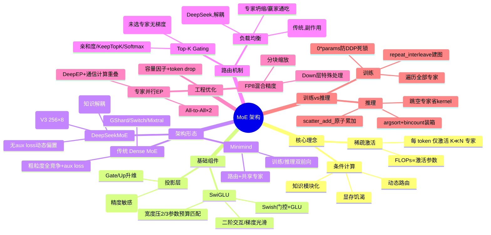

# 架构:混合专家模型(MoE)

## 一句话精炼

MoE 通过稀疏激活与条件计算,把"模型总参数量(知识容量)"与"单 token 激活参数量(算力成本)"解耦——以 DeepSeek-V3 为代表的"细粒度路由专家 + 共享专家 + 无辅助损失动态偏置"组合,在不增加推理算力的前提下撬动数倍参数容量,是后摩尔定律时代打破算力墙的核心架构。

## 核心概念

- **稀疏激活 / Sparse Activation**:Dense Transformer 每个 token 都要走完全部参数,FLOPs ∝ 总参数;MoE 把 FFN 拆成 N 个"专家",每 token 仅激活 K ≪ N 个,FLOPs 只与激活参数成正比。
- **条件计算 / Conditional Computation**:不同 token 动态走不同计算路径,实现知识模块化存储(代码/数学/语言各占一域)。代价:所有参数须常驻显存,故 MoE "计算高效但显存饥渴"。
- **总参数量 vs 激活参数量**:两个独立度量维度。DeepSeek-V3 总 671B / 激活 37B(稀疏比 ~5.5%);Mixtral 8x7B 总 47B / 激活 13B(~27%)。
- **Dense MoE**:本文未明确使用此术语,可理解为传统粗粒度、全竞争式激活的 MoE(如 GShard/Switch/Mixtral),对应 DeepSeek 的"细粒度 + 共享"稀疏形态。
- **Top-k 路由 / Gating**:Router 算亲和度 → KeepTopK 截断 → Softmax 归一 → 加权求和。
- **专家坍缩 / Expert Collapse**:Top-k 路由下"赢家通吃",少数专家吃掉所有 token,其余变"死专家",模型退化为小稠密模型。
- **辅助损失 / Aux Loss**:传统负载均衡项,强制每个专家利用率 f_i 与平均概率 P_i 趋近 1/N;副作用是"为均衡而路由到次优专家",损害主任务性能。
- **无辅助损失负载均衡 / Auxiliary-Loss-Free**:DeepSeek-V3 首创,在 router logits 上加一个不参与梯度下降的偏置 b_i,按 PID 式规则动态调整(过载减、空闲增),把"学路由"与"做交通管制"解耦。
- **专家容量 / Capacity**:C = (Tokens/Batch)/N × Capacity Factor,CF 取 1.0~1.2;超出容量 token 被 drop,经残差直通。
- **细粒度专家 / Fine-Grained Experts**:把大专家切碎成很多小专家(V2:160×激活6;V3:256×激活8),组合爆炸带来更强表达。
- **共享专家 / Shared Experts**:总是激活、不参与路由,专攻"公共知识",消除跨专家冗余存储,实现知识解耦(V2:2个;V3:1个更大容量)。
- **SwiGLU**:Swish + GLU 门控,引入 x² 级二阶交互、梯度光滑;为参数预算公平,隐藏宽度压到标准 4d 的 2/3,故 Llama2-7B 中间层 = 11008 ≈ (2/3)×16384。
- **专家并行 / EP**:不同专家分布到不同 GPU,引入 Dispatch/Combine 两次 All-to-All 通信。
- **FP8 混合精度**:显存/带宽减半,Tensor Core 理论 2× 加速;需细粒度分块缩放,Down Projection 对精度敏感需特殊处理。

## 关键公式

### MoE 层输出(稀疏加权和)

$$y = \sum_{i=1}^{N} G(x)_i E_i(x)$$

其中 $G(x)$ 为门控/路由器输出,$E_i$ 为第 i 个专家。

### DeepSeek 含共享专家形式(知识解耦)

$$y = \sum_{i \in A_{shared}} E_i(x) + \sum_{j \in TopK(G(x))} g_j E_j(x)$$

$A_{shared}$ 为共享专家集合,恒激活。

### Router gate(Top-K Gating)

$$h(x) = x \cdot W_r, \quad W_r \in \mathbb{R}^{d_{model}\times N}$$

$$\text{KeepTopK}(h(x), K)_i = \begin{cases} h(x)_i & \text{if } h(x)_i \in \text{Top-}K(h(x)) \\ -\infty & \text{otherwise} \end{cases}$$

$$G(x) = \text{Softmax}(\text{KeepTopK}(h(x), K))$$

### SwiGLU FFN

$$\text{FFN}_{SwiGLU}(x) = \big(\text{Swish}(xW_g) \odot (xW_u)\big) W_d, \quad \text{Swish}(x)=x\cdot\sigma(x)=\frac{x}{1+e^{-x}}$$

参数预算匹配推导:$3 \cdot d \cdot h' = 2 \cdot d \cdot h \Rightarrow h' = \frac{2}{3}h$,故 $d_{ff}\approx\frac{8}{3}d$。

### 传统辅助损失(Load Balancing / Aux Loss)

记 $f_i$ = 批内路由到专家 i 的 token 比例,$P_i$ = router 给专家 i 的平均概率:

$$L_{aux} = \alpha \cdot N \sum_{i=1}^{N} f_i \cdot P_i$$

方差形式:

$$L_{aux} = \sum_{j=1}^{N}\left(\frac{1}{N} - \frac{1}{T}\sum_{i=1}^{T} g_{ij}\right)^2$$

Minimind 中 token 级实现:$\text{aux\_loss} = (P_i \cdot f_i \cdot N)\cdot\alpha$,仅当概率均匀时点积最小。

### DeepSeek 无辅助损失(动态偏置,非损失项)

$$\text{Score}_i = x \cdot W_{r,i} + b_i$$

$b_i$ 不参与梯度下降,按负载 PID 调整:过载 $b_i \leftarrow b_i - \gamma$,空闲 $b_i \leftarrow b_i + \gamma$。

### 专家容量与 token drop

$$C = \frac{\text{Tokens per Batch}}{N} \times \text{Capacity Factor}$$

超 $C$ 的多余 token 被丢弃,经残差直通。

### z-loss

本文未单独给出 z-loss 公式,提及 Top-k 路由可微性问题时提到用噪声/Gumbel-Softmax 缓解未选中专家无梯度问题;传统方案另设 z-loss 约束 router logits 平方以稳训练,但文中未展开。(批注:如需补 z-loss 应查原 Switch Transformer 论文 $L_z = \frac{1}{B}\sum (\text{logit})^2$。)

## 架构演进

```
MoE 形态演进(粗放 → 精细,云端 → 端侧)
│
├─ 早期学术: GShard / Switch Transformer
│   · 粗粒度大专家, 全竞争路由
│   · 引入 aux loss + capacity factor + token drop
│
├─ Mistral Mixtral 8x7B / 8x22B
│   · 标准 Top-2 路由
│   · 8 个粗粒度专家, 单专家知识混合重
│
├─ DeepSeekMoE (V2 → V3) 革命
│   ├ 细粒度专家分割: V2 160路×激活6; V3 256路×激活8, 组合爆炸
│   ├ 共享专家: V2 2个; V3 1个更大容量, 恒激活, 知识解耦
│   └ 无辅助损失路由: V3 动态偏置 b_i, PID 式调整
│
└─ Minimind 轻量化 MoE
    · 同样采用 路由专家 + 共享专家
    · 可配 n_routed_experts / n_shared_experts / top_k
    · 训练/推理两套前向实现(autograd 正确 vs 极速)
```

DeepSeek-V3 vs 主流模型(文末表):

| 特性 | DeepSeek-V3 | Llama-3.1-405B | Mixtral 8x22B |
|---|---|---|---|
| 架构 | MoE(细粒度+共享) | Dense | MoE(标准Top-2) |
| 总参/激活 | 671B / 37B | 405B / 405B | 141B / 39B |
| 层数 | 61 | 126 | 56 |
| 专家 | 256 routed + 1 shared | N/A | 8 |
| 注意力 | MLA | GQA | GQA |
| 训练精度 | FP8 混合 | BF16 | BF16 |
| 负载均衡 | 无 aux loss(Bias) | N/A | aux loss |

## 关键算法/流程

### Top-K 路由选择(可微性陷阱)

1. 算亲和度 $h(x)=xW_r$ (N 维)
2. KeepTopK 截断:保留前 K,其余置 $-\infty$
3. Softmax 归一 → 门控权重 $G(x)$,仅 K 个非零且和为 1
4. 加权求和 $y=\sum G_i E_i(x)$

可微性:被选中专家的 $G_i$ 对 $W_r$ 可导,梯度可回传;**未被选中的专家拿不到梯度**——模型能学"给被选专家分多少权重",但难直接学"选哪个专家"。大规模 LLM 中 Top-k + aux loss 通常已够用。

### 负载均衡:从 aux loss 到无 aux loss

- **传统(Switch/GShard/Mixtral)**:$L_{aux}=\alpha N\sum f_i P_i$,强行逼近均匀分布,副作用是次优路由损害主任务。
- **DeepSeek-V3**:移除 aux loss,改在 logits 加非梯度偏置 $b_i$,$W_r$ 只受 CE loss 优化(学最优路由),$b_i$ 只受负载统计调整(做交通管制),二者解耦 → 256 专家下仍极佳均衡且性能更高。

### Token drop / 容量因子

- $C=\text{Tokens/Batch}/N \times CF$,CF 1.0~1.2,超量丢弃走残差。
- DeepSeek 策略:无 EP(小规模)不丢;大规模 EP 为防 OOM/straggler 才丢;因动态偏置已极均衡,实际 drop 率极低。

### 训练 vs 推理两套前向(Minimind 核心)

- **训练**:目标"autograd 正确 + DDP 稳定"。`repeat_interleave` 复制 token 显式建图;空专家 `y[mask] = expert_out + 0*sum(params)` 构造零依赖参数节点,防 DDP 同步死锁;遍历全部专家(大 batch 下循环开销可忽略)。
- **推理**:目标"延迟最低"。`@torch.no_grad()`;argsort+bincount+cumsum 按专家装箱,`if start==end: continue` 跳过空专家省 kernel launch;`scatter_add_` 原子累加省显存。仅处理有负载专家。

## 工程实践

### 通信开销 / Expert Parallelism

- DP 对 MoE 不适用(总参太大单卡放不下);TP 适合 Attention;EP 把不同专家放不同 GPU(GPU0 持专家1-64,GPU1 持65-128)。
- EP 引入两次 **All-to-All**:Dispatch(token 发往目标专家所在 GPU)+ Combine(结果发回原位)。
- DeepSeek-V3 用 DeepEP CUDA 内核 + NVLink,实现**通信与计算重叠**(算 Attention 时后台预取 MoE 跨卡数据)掩盖延迟。

### 容量与 drop

见上,CF 1.0~1.2,大规模 EP 才丢,动态偏置下 drop 率极低。

### FP8 混合精度训练

- 显存 −50%、带宽 −50%、Tensor Core 理论 2× 加速。
- 难点:动态范围窄易溢出/下溢。DeepSeek 用**细粒度分块量化**(block-wise scaling)对 MoE 输入/权重/中间激活分块缩放;Down Projection(对精度最敏感)特殊处理,几乎无损精度。
- 结果:DeepSeek-V3 训练成本仅 278 万 H800 机时,约同级模型 1/10。

### 推理部署

- MoE "计算高效但显存饥渴":推理 FLOPs 低但所有参数须常驻 VRAM,消费级显卡部署困难,云端大放异彩。
- 小 batch(如 decoding=1)用 argsort+bincount 推理路径跳空专家,降 kernel launch overhead。

## 源码要点(Minimind MoE 实现)

文件中三段关键类(位于原文 4.2/5.4):

### 1. `FeedForward` — SwiGLU 单专家

- `intermediate_size` 默认 `hidden*8/3`,向上取整到 64 倍数(如 512→1408=64×22)优化 GPU。
- 三个 `nn.Linear(bias=False)`:gate_proj / up_proj / down_proj。
- forward:`down_proj(act_fn(gate_proj(x)) * up_proj(x))`,即 SwiGLU。
- 激活函数从 `ACT2FN[config.hidden_act]` 取(通常 silu/Swish)。

### 2. `MOEFeedForward` — MoE 层(路由+共享)

- 路由专家 `nn.ModuleList([FeedForward]*n_routed_experts)`;门控 `MoEGate(config)`;可选共享专家 `nn.ModuleList([FeedForward]*n_shared_experts)`。
- forward 三步:
  1. `topk_idx, topk_weight, aux_loss = self.gate(x)`
  2. 训练分支:`repeat_interleave(top_k)` 复制 token → 遍历专家用 `mask=flat_topk_idx==i` 取该专家 token → 空专家 `+0*sum(params)` 保梯度流 → `view+*topk_weight+.sum(dim=1)` 加权合并;推理分支:`moe_infer`。
  3. 共享专家恒激活:`y = y + expert(identity)`(残差式直加)。
- `self.aux_loss` 暴露给外层加到总 loss。
- `moe_infer`:`argsort` 按专家排序 → `bincount().cumsum(0)` 算每专家 token 范围 → `token_idxs//top_k` 还原原索引 → 跳空专家 → 批量算 `expert(tokens).mul_(weights)` → `scatter_add_` 原子累加回 cache。

### 3. `MoEGate` — 路由门控

- `weight: [n_routed_experts, hidden_size]`,Kaiming 均匀初始化。
- forward:
  1. 展平 `[bsz,seq,h]→[bsz*seq,h]`;`F.linear(x, weight)` 得 logits `[T, N]`。
  2. `softmax(dim=-1)` 得 scores。
  3. `torch.topk(scores, k=top_k, sorted=False)` 得 topk_weight / topk_idx。
  4. 若 `top_k>1 and norm_topk_prob`:topk_weight 归一化和为 1(加 1e-20 防 0)。
  5. 训练 + α>0 算 aux loss:
     - `seq_aux=True`(DeepSeek-V2/V3 风格,序列级):`scatter_add_` 统计 batch 内每专家被选次数 → 归一化 `div_(seq_len*top_k/N)` → `aux_loss=(ce*scores.mean(dim=1)).sum(dim=1).mean()*α`。
     - `seq_aux=False`(Switch 风格,token 级):`one_hot` → `ce=mask.mean(0)`;`Pi=scores.mean(0)`;`fi=ce*N`;`aux_loss=(Pi*fi).sum()*α`。
- 返回 `(topk_idx, topk_weight, aux_loss)`。

**值得记住的工程细节**:
- 训练空专家的 `0*sum(params)` 防止 DDP hang,是 MoE 分布式训练经典 hack。
- top_k>1 时权重归一(`norm_topk_prob`)确保多专家权重和为 1。
- 推理路径用 `@torch.no_grad()` + in-place `mul_`/`scatter_add_`,autograd 不友好但极速。

## 作者独到见解/类比

- **仿生学类比**:人脑不激活全部神经元,按任务调特定功能区;MoE 稀疏激活即此思想的工程化。
- **"收费站 vs 双车道智能阀门"**:ReLU/GeLU 是单行道+收费站(硬截断,信息永久丢失,神经元死亡);SwiGLU 是双车道+智能阀门(门控路算 0~1 开度,模型自学"保留 10% 还是 90%")。
- **"用宽度换深度/复杂交互"**:SwiGLU 引入 x² 二阶交互,虽多一矩阵但宽度压到 2/3 即可在同预算下换更强表达——经典工程权衡。
- **"通识与专才的解耦"**:共享专家=通识基底,路由专家=差异化技能树,回归人类认知本质,这是 DeepSeek 架构哲学的核心。
- **"让 autograd 引擎满意 vs 让 GPU 利用率最高"**:训练代码与推理代码分裂的一句话本质——前者为求导正确与 DDP 稳定,后者为延迟最低。
- **"系统工程新阶段"**:大模型竞争已不只是算法胜利,DeepSeek-V3 对 FP8/All-to-All 的极致压榨标志进入 System Engineering 阶段。
- **训练/推理 batch 差异洞察**:训练大 batch 用 mask 循环遍历全部专家无妨(Python 循环被 GPU 计算淹没);推理小 batch(=1)必须 argsort+跳空专家省 kernel launch。

## 面试考点

### 为何 MoE 推理省算力但训练难?

- **省算力(推理)**:稀疏激活,每 token 仅走 K≪N 个专家,FLOPs ∝ 激活参数(37B)而非总参数(671B);条件计算使知识模块化。
- **训练难**:
  1. 路由 Top-k 含 ArgMax 性质不可导,未选专家无梯度,需 aux loss/噪声/Gumbel 缓解。
  2. 专家坍缩(赢家通吃),需负载均衡约束。
  3. EP 引入两次 All-to-All 通信(Dispatch/Combine),通信墙严重,需 DeepEP+NVLink+计算通信重叠。
  4. DDP 下空专家梯度 None 致同步死锁,需 `0*params` hack。
  5. 大量参数显存饥渴,须 EP+FP8 细粒度量化。
  6. 训练稳定性(FP8 溢出/下溢、aux loss 与主任务冲突)。

### 负载均衡为何重要?

- 不均衡 → 专家坍缩 → 死专家 → 退化为小稠密模型,浪费参数容量、破坏稀疏收益。
- 传统 aux loss 强迫均匀但损害主任务(次优路由);DeepSeek 无 aux loss 用动态偏置 b_i 解耦"学路由"与"交通管制",256 专家下仍均衡且性能更高。

### 其他高频考点

- SwiGLU 为何成首选:二阶交互 + 梯度光滑 + 无死区;2/3 系数由来(参数预算匹配推导)。
- 共享专家作用:消除公共知识冗余存储,知识解耦,提升参数效率。
- 细粒度专家优势:组合爆炸,表达力远超粗粒度固定组合。
- 训练/推理代码为何不同:autograd 正确性+DDP 稳定 vs 极速低延迟(见对比表)。
- 容量因子与 token drop:CF 1.0~1.2,超量走残差,大规模 EP 才用。
- DeepSeek-V3 训练成本 278 万 H800 机时(同级 1/10)靠 FP8 + 通信重叠 + 无 aux loss。

## 批判性批注

- **"Dense MoE"术语未定义**:开篇模板列 Dense MoE,但正文未出现该术语,需读者自行理解为"传统粗粒度全竞争 MoE",存在术语缺口。
- **z-loss 缺位**:模板要求 z-loss 公式,但原文仅在路由可微性处提噪声/Gumbel-Softmax,未给 z-loss 数学定义。补注:Switch 原文 $L_z=\frac{1}{B}\sum_i(\text{logit}_i)^2$ 约束 logits 平方稳训练,此处应自行补全。
- **GPT-4 数据为"社区推测"**:表 2-1 标 ~1.8T/~200B?/N/A,标注为推测,作为对比基准可信度低,引用时需声明不确定性。
- **"推理省算力"叙述略过显存代价**:条件计算一节虽提"显存饥渴",但核心宣称仍偏乐观;实际部署 MoE 的 VRAM 门槛是消费级落地主要障碍,应更突出权衡。
- **DeepSeek-V3 性能归因偏单一**:把 SOTA 归于"无 aux loss + 细粒度 + 共享专家",但 MLA 注意力、FP8、通信重叠、数据/RL 等同样关键,归因应更系统。
- **Minimind 与工业级差距自承不足**:作者承认"工业级训练/部署优化 Minimind 无法呈现",但仍把 Minimind 当主要代码载体,读者易误把玩具实现当生产范式;建议明确边界。
- **aux loss 方差形式与点积形式不严格等价**:文中并列给 $N\sum f_iP_i$ 与方差 $\sum(1/N-\bar g)^2$,二者优化面不同,未讨论差异,易误导。
- **FP8 "几乎不损失精度"缺量化证据**:仅定性叙述,未给 PPL/loss 曲线对比,工程宣称应附数据。
- **未来趋势一节过于宽泛**:"MoE 与 Reasoning 融合""记忆与推理解耦"指向"看最新文章",信息密度低。

## 篇内小思维导图


