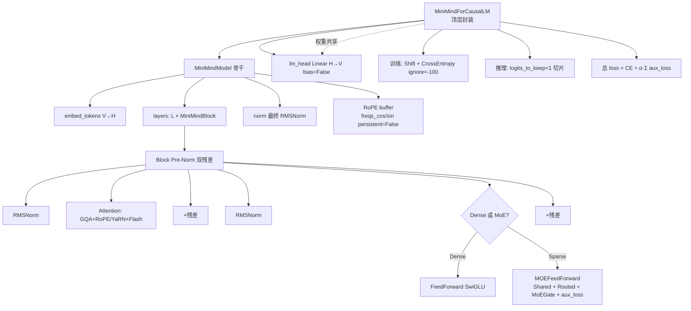

# 架构:超级拼装(搭建自己的大模型)

## 一句话精炼
把前文各模块(embedding/RMSNorm/Attention/FFN 或 MoE/lm_head)按 Pre-Norm + 残差的标准 Decoder-Only 骨架拼成 MiniMind,特色是 YaRN 外推 + DeepSeek 式 Shared+Routed MoE + Gemma 式权重共享 + 全系 GQA,是 LLaMA 骨架上的"小而全"现代 LLM。

## 核心概念(各模块如何组装成一个完整 Transformer)

- **MiniMindConfig (继承 PretrainedConfig)**:模型"控制台"。hidden_size/层数/头数/词表等基础超参,内含 YaRN 外推开关与 MoE 开关,可从 Dense 无缝切到 Sparse。
- **RMSNorm**:仅缩放不去均值(无中心化),比 LayerNorm 计算小、数值稳,LLaMA/Gemma 标配。Pre-Norm 布置在子层之前。
- **Attention 类**:上下文聚合核心。
  - GQA:`num_attention_heads > num_key_value_heads`,通过 `repeat_kv` 复制 KV,降低 KV Cache 显存。
  - RoPE + YaRN:旋转位置编码;YaRN 动态调频(beta_fast/beta_slow),免训练外推到 32k。
  - Flash Attention:环境支持时直调 `F.scaled_dot_product_attention`。
- **FeedForward (Dense)**:SwiGLU。Gate×Up→Swish→Down,收敛性与性能优于 ReLU+FFN。
- **MOEFeedForward (Sparse)**:DeepSeek-V2/V3 风格。
  - Shared Experts:`n_shared_experts` 个,所有 Token 必经,捕获通用知识。
  - Routed Experts:`n_routed_experts` 个,MoEGate 动态选 Top-K。
  - MoEGate:计算评分 + Top-K + 辅助损失 Aux Loss 防负载不均。
  - 输出 = 共享专家 + Σ(路由专家 × 门控权重)。
- **MiniMindBlock**:标准层,Pre-Norm + 双残差。
  - `x → RMSNorm → Attention → +x`
  - `x → RMSNorm → FFN/MoE → +x`
- **MiniMindModel**:Decoder 骨干。embed_tokens + L×Block + 最终 RMSNorm + 预计算 RoPE buffer(persistent=False)。
- **MiniMindForCausalLM(继承 PreTrainedModel, GenerationMixin)**:顶层封装。backbone + lm_head;**权重共享(Weight Tying)**:`embed_tokens.weight = lm_head.weight`;支持 logits_to_keep 切片优化;训练时 Shift Prediction + CrossEntropy(ignore_index=-100)。

## 整体架构/数据流(前向流程,逐层张量形状变化)

符号约定:B 批 / S 序列长 / H 隐藏维 / V 词表 / L 层 / HD 头维(H//num_heads)/ MaxPos 最大位置。

1. 输入 `input_ids`:`[B, S]`(训练 S=N;推理 Decoding S=1)。
2. `embed_tokens`:`[B, S] → [B, S, H]`(此时有语义、无位置)。
3. RoPE 预计算 buffer:`freqs_cos / freqs_sin` 形状 `[MaxPos, HD]`;按 `start_pos : start_pos + seq_length` 切片得 `position_embeddings`。
   - 训练/Prefill:start_pos=0,取前 N 个。
   - Decoding:start_pos=N,取第 N 个(长度 1)。
4. start_pos 推断:有缓存则 `past_kv[0][0].shape[1]`,否则 0。
5. 逐层进入 MiniMindBlock(共 L 层):
   - `[B, S, H] → RMSNorm → Attention(含 RoPE、KV Cache 更新) → +残差 → [B, S, H]`
   - `→ RMSNorm → FFN/MoE(MoE 层同时算 aux_loss) → +残差 → [B, S, H]`
   - 每层返回新 KV Cache `present`,形状 `[B, Past_Len+S, H_kv, HD]`。
6. 最终 `RMSNorm`:`[B, S, H]`。
7. 汇总 MoE aux_loss:对所有 `isinstance(mlp, MOEFeedForward)` 层求和;无 MoE 则为 0。
8. MiniMindForCausalLM:
   - Logits Slicing:`logits_to_keep=1` → `hidden[:, -1:, :]`;`=0` → 全量(训练)。
   - `lm_head`:`[B, Sliced, H] → [B, Sliced, V]`。
   - 训练 Shift:`shift_logits = logits[..., :-1, :]`、`shift_labels = labels[..., 1:]`,CrossEntropy 展平、ignore_index=-100。
   - 输出 `CausalLMOutputWithPast`,挂 `output.aux_loss`;训练循环里 `total = loss + α·aux_loss`。

## 关键公式(如涉及)

- RMSNorm(无中心化):`RMSNorm(x) = x / RMS(x) · γ`,`RMS(x) = sqrt(mean(x²) + eps)`。
- SwiGLU:`FFN(x) = (Swish(x·W_gate) ⊙ (x·W_up)) · W_down`。
- MoE 输出:`y = SharedExperts(x) + Σ_{k∈TopK} g_k · RoutedExpert_k(x)`(g 为门控权重)。
- Shift 因果预测:`logits[..., :-1, :] ↔ labels[..., 1:]`。
- 权重共享:`embed_tokens.weight ← lm_head.weight`(同 H×V 矩阵)。
- 训练总损失:`L_total = CE_loss + α · Σ_layers aux_loss`。

## 源码要点(Minimind 模型主体代码要点)

- **MiniMindModel.__init__**:
  - `embed_tokens = nn.Embedding(V, H)`;`dropout = nn.Dropout(config.dropout)`。
  - `layers = nn.ModuleList([MiniMindBlock(l, config) for l in range(L)])`(层索引 l 传入,便于 YaRN 等分层逻辑)。
  - `norm = RMSNorm(H, eps=config.rms_norm_eps)`(LLaMA 末尾标准做法)。
  - `precompute_freqs_cis(dim=H//num_heads, end=max_position_embeddings, rope_base=rope_theta, rope_scaling=rope_scaling)`;`register_buffer(..., persistent=False)`——不写盘、可按 config 重算。
- **MiniMindModel.forward**:
  - HF 新版 Cache 对象降级:`if hasattr(past_key_values, 'layers'): past_key_values = None`(安全兜底)。
  - `past_key_values = past_key_values or [None]*len(layers)`。
  - RoPE 切片:`position_embeddings = (freqs_cos[start:start+S], freqs_sin[start:start+S])`。
  - 逐层 `zip(self.layers, past_key_values)`,收集 `presents`。
  - `aux_loss = sum([l.mlp.aux_loss for l in layers if isinstance(l.mlp, MOEFeedForward)], hidden_states.new_zeros(1).squeeze())`——用零张量做起点,保证 Dense 模式返回标量 0。
- **MiniMindForCausalLM.__init__**:
  - `self.model = MiniMindModel(config)`;`self.lm_head = nn.Linear(H, V, bias=False)`(无 bias,数值稳)。
  - `self.model.embed_tokens.weight = self.lm_head.weight`(权重 tying,省 H×V 参数)。
- **MiniMindForCausalLM.forward**:
  - `logits_to_keep` 支持 int 或 Tensor;int>0 取 `slice(-k, None)`,`=0` 取全量。
  - `sliced_hidden = hidden_states[:, slice_indices, :]`;`logits = self.lm_head(sliced_hidden)`。
  - 训练分支 Shift + `F.cross_entropy(shift_logits.view(-1, V), shift_labels.view(-1), ignore_index=-100)`。
  - 输出封装 `CausalLMOutputWithPast`,再 `output.aux_loss = aux_loss`。

## 作者独到见解/类比

- 作者强调本章"不只是拼起来",而要交代拼装细节:buffer 的 persistent=False、KV Cache 的兼容降级、aux_loss 汇总起点用零张量、logits_to_keep 切片省掉 lm_head 无用矩阵乘等,都是工程落地要点。
- **MiniMind 不是 LLaMA 简单复刻**:LLaMA 骨架 + DeepSeek 式 MoE + YaRN 外推 + Gemma/GPT-2 式 Tied Embedding,是"现代 LLM 特性博物馆"。
- **物理意义解释权重共享**:"输入一个词"和"预测一个词"共用同一语义空间——既是参数节省,也是建模哲学。
- **共享专家 vs Mixtral**:作者认为 Shared+Routed 比纯 Routed(Mixtral)训练更稳、知识表达更强。
- **Gemma 式轻量化**:Tied Embedding 对中小模型尤其友好,大模型(如 LLaMA) Untied 是为表达力。

## 面试考点(为何这么组装、Pre-Norm 拮抗等)

- **Pre-Norm vs Post-Norm**:Pre-Norm 残差通路梯度更直,深层不发散,大模型标配;Post-Norm 表达力略强但深层训练不稳,需 warmup/LayerScale。
- **RMSNorm vs LayerNorm**:去均值省算力、数值稳;面试常问"为何 LLaMA 选 RMSNorm"。
- **GQA 必要性**:KV Cache 显存随头数线性增长,GQA 让 KV 头远少于 Q 头,推理吞吐显著提升;`repeat_kv` 广播复制。
- **YaRN 外推原理**:动态调频,让训练长度外推到 32k 而不微调;与线性插值(需微调)对比。
- **SwiGLU 为何优于 ReLU FFN**:门控乘性带来更好收敛与性能,代价是多一个投影矩阵。
- **Weight Tying 取舍**:省 H×V 参数、正则化效果;但可能限制输出表达,大模型倾向 Untied。
- **Shift Prediction 为何必须**:因果 LM 第 t 步预测 t+1,通过错位让一次前向算出所有 token 的 loss(并行训练)。
- **aux_loss 作用与求和方式**:防 MoE 路由崩塌(所有 token 挤同一专家);训练 loss = 主 loss + α·aux_loss。
- **logits_to_keep=1**:推理 Decoding 只需最后 token,切片省 O(S·H·V) 的 lm_head 乘法。
- **persistent=False 的 buffer**:RoPE 表可由 config 重建,不占权重文件、避免加载冲突。
- **ignore_index=-100**:padding 不计入梯度。

## 批判性批注

- 本章代码注释详尽但**未展示 MiniMindBlock 内部**与 MoEGate 细节(留到前文或后续),单读此章难以独立复现 Block 与 Gate;笔记层面需补"Block = norm+attn+残+norm+mlp+残"的接口假设。
- **权重共享的代价未讨论**:对大词表(64k+)和 hidden 较小时,tying 会限制 lm_head 表达力,现代大模型(如 LLaMA-2/3)反而 Untied;作者归为"Gemma 式轻量化",但对"何时该 tying"缺少判据。
- **YaRN "无需训练外推"偏乐观**:实际常仍需少量长文本微调或 at least 验证 perplexity;文档表述偏 marketing。
- **GQA "全系支持"表述**:小模型 Q 头本就不多,GQA 收益边际化,且 `repeat_kv` 复制后计算量未必下降,主要是省 KV Cache 存储而非算力——文中未区分"显存"与"算力"。
- **MoE 选 DeepSeek 风格**合理,但 `n_shared_experts`、Top-K、aux_loss 系数 α 的取值与稳定性经验本章未给,面试追问会露怯。
- **HF Cache 降级**:`hasattr(past_key_values,'layers')` 直接清空缓存,是"防止报错"的兜底而非真正兼容,生产环境可能默默退化为无 Cache 推理,需告警而非静默。
- **代码中 `self.config = config or MiniMindConfig()` 在 `super().__init__` 之前赋值**,依赖父类构造是否使用 self.config,属脆弱写法,建议先 super 再设。

## 章内小思维导图

