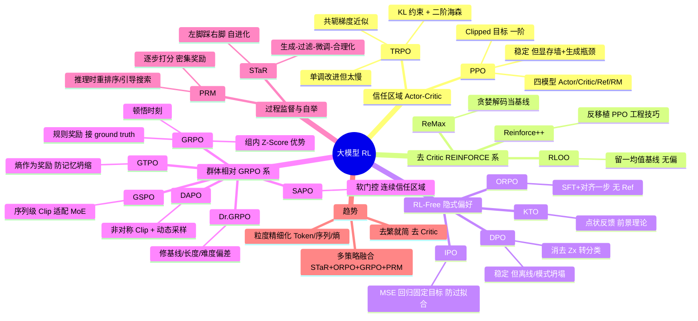

# 算法:大模型强化学习算法概览

## 一句话精炼

大模型 RL 的演进主线是"去 Critic、去显式 RM、粒度精细化":从 TRPO/PPO 的信任区域 + 四模型架构,到 ReMax/RLOO 的无 Critic 方差缩减,再到 DPO 系列的隐式偏好(把 RL 转成分类),最终由 GRPO 及其变体(Dr.GRPO/DAPO/GSPO/SAPO/GTPO)以"群体相对基线 + 规则奖励"在推理任务上涌现顿悟。

## 核心概念

### RL 基础
- **MDP(马尔可夫决策过程)**:状态 $s$、动作 $a$、转移 $P(s'|s,a)$、奖励 $r$、策略 $\pi(a|s)$。LLM 中,Prompt 即状态 $s$,生成 token 即动作 $a$,状态转移是确定性的(Prompt 一次性、转移确定)——这是 ReMax/RLOO 能去掉 Critic 的前提。
- **策略 $\pi_\theta$**:参数化的条件概率 $\pi_\theta(a|s)$ 或 $\pi_\theta(y|x)$,即 LLM 本身。
- **价值函数 $V(s)$**:从状态 $s$ 出发的期望回报,由 Critic 网络近似。
- **优势函数 $A(s,a)$**:$A = Q(s,a) - V(s)$,衡量"这个动作比平均好多少"。PPO 中用 GAE 估计;GRPO 中用组内 Z-Score 替代。
- **重要性采样比率**:$r_t(\theta) = \pi_\theta/\pi_{old}$,新旧策略概率之比。

### RLHF 三阶段(经典 InstructGPT 范式)
1. **SFT**:监督微调,教模型"怎么说话"。
2. **RM**:训练奖励模型 $r_\phi(x,y)$,从人类偏好数据 $(y_w, y_l)$ 用 Bradley-Terry 损失学习。
3. **PPO**:以 RM 为奖励源、以 SFT 模型为 Reference,在线采样 + KL 约束优化 Actor。

### 各算法的定位
- **TRPO**:信任区域奠基,二阶优化,理论单调改进但算不动海森矩阵。
- **PPO**:一阶 + Clipping 的工业标准,稳定但需四模型、显存墙。
- **ReMax / RLOO / Reinforce++**:去 Critic 的 REINFORCE 变体,用贪婪/留一/工程技巧做基线。
- **DPO / IPO / KTO / ORPO**:RL-Free,从显式 RM 转向隐式偏好,把 RL 变成分类/回归。
- **GRPO**:群体相对基线,规则奖励,DeepSeek-R1 推理涌现。
- **Dr.GRPO / DAPO / GSPO / SAPO / GTPO**:修正 GRPO 的统计偏差、稳定性、粒度。
- **PRM / STaR**:过程监督与自举,超越结果反馈。

## 关键公式

### 1. TRPO 带约束优化(信任区域)
$$\max_\theta \mathbb{E}_t\left[\frac{\pi_\theta(a_t|s_t)}{\pi_{\theta_{old}}(a_t|s_t)} A_t\right] \quad \text{s.t.} \quad \mathbb{E}_t[\mathrm{KL}(\pi_{\theta_{old}}(\cdot|s_t)\|\pi_\theta(\cdot|s_t))] \le \delta$$
- KL 约束做二阶泰勒展开引入海森矩阵 $H$,7B 模型 $H$ 是 $7e9 \times 7e9$,用共轭梯度近似 $H^{-1}g$。

### 2. PPO Clipped 目标
$$L^{CLIP}(\theta) = \mathbb{E}\left[\min\left(r_t(\theta)\hat A_t,\ \mathrm{clip}(r_t(\theta), 1-\epsilon, 1+\epsilon)\hat A_t\right)\right]$$
- $\epsilon \approx 0.2$;$A_t>0$ 时上限 clip 在 1.2 防过度自信;$A_t<0$ 时下限 clip 在 0.8 防放弃探索。
- 总损失 = policy loss + 0.5·MSE(value, returns) [+ entropy bonus]。

### 3. RLHF 原始目标(KL 约束的最大回报)
$$\max_\pi \mathbb{E}_{x\sim D, y\sim\pi}\left[r(x,y) - \beta D_{KL}(\pi(y|x)\|\pi_{ref}(y|x))\right]$$

### 4. 最优策略闭式解(DPO 推导起点)
$$\pi^*(y|x) = \frac{1}{Z(x)}\pi_{ref}(y|x)\exp\left(\frac{1}{\beta}r(x,y)\right), \quad Z(x) = \sum_y \pi_{ref}(y|x)\exp\left(\frac{1}{\beta}r(x,y)\right)$$
- $Z(x)$ 不可计算(对所有 $y$ 求和)。

### 5. Bradley-Terry 偏好模型
$$P(y_w \succ y_l | x) = \sigma\left(r(x,y_w) - r(x,y_l)\right)$$

### 6. DPO 损失(消去 $Z(x)$ 与显式 $r$)
$$L_{DPO} = -\mathbb{E}_{(x,y_w,y_l)}\left[\log\sigma\left(\beta\log\frac{\pi_\theta(y_w|x)}{\pi_{ref}(y_w|x)} - \beta\log\frac{\pi_\theta(y_l|x)}{\pi_{ref}(y_l|x)}\right)\right]$$

### 7. GRPO 优势估计(组内 Z-Score,核心)
$$A_i = \frac{r_i - \mathrm{mean}(\{r_1,\dots,r_G\})}{\mathrm{std}(\{r_1,\dots,r_G\}) + \epsilon}$$
- GRPO 目标:
$$L_{GRPO} = \mathbb{E}\left[\min\left(\tfrac{\pi_\theta}{\pi_{old}}A_i,\ \mathrm{clip}(\tfrac{\pi_\theta}{\pi_{old}},1-\epsilon,1+\epsilon)A_i\right)\right] - \beta D_{KL}(\pi_\theta\|\pi_{ref})$$

### 8. RLOO 留一基线
$$b_i = \frac{1}{K-1}\sum_{j\ne i} R(x,y_j), \quad A_i = R(x,y_i) - b_i$$

### 9. IPO 损失(MSE 回归到固定目标)
$$L_{IPO} = \mathbb{E}\left[\left(\log\frac{\pi(y_w|x)}{\pi_{ref}(y_w|x)} - \log\frac{\pi(y_l|x)}{\pi_{ref}(y_l|x)} - \tfrac{\gamma}{2}\right)^2\right]$$

## RLHF 流程(SFT → RM → PPO 全链路)

```
[人类示范数据]
      │ SFT(监督微调,MLE)
      ▼
   π_SFT (Reference Model,参数冻结)──────────────┐
      │                                          │ KL 约束
      │ 人类偏好对 (y_w, y_l)                     │
      ▼                                          ▼
   Reward Model r_φ (Bradley-Terry loss,冻结)   Actor π_θ(可训练)
      │  打分 r(x,y)                          ↗
      │                                      / 重要性采样比率
      ▼                                     /
   Actor 在线采样 rollout ──→ RM 打分 ──→ 优势 A=GAE(R,V)
      │                                      │
      ▼                                      ▼
   Critic V_φ(可训练) 估计 V(s) ───────── PPO Clipped 更新 Actor+Critic
                                              │
                                              ▼
                                          对齐后的 LLM
```

四模型显存角色:Actor(训练)、Critic(训练)、Reference(冻结,KL 锚点)、RM(冻结,打分)。PPO 是 on-policy,90% 时间耗在生成 rollout 上。

## 算法对比表

| 算法 | 需 Critic | 需 RM | 需 Ref | 在/离线 | 显存 | 数据形式 | 何时用 |
|------|----------|------|--------|---------|------|----------|--------|
| **TRPO** | 是 | 是 | 隐式 | 在线 | 极高 | 轨迹 | 理论参考,基本不用 |
| **PPO** | 是 | 是 | 是 | 在线 | 极高(4模型) | 轨迹 | 通用 RLHF、机器人、ChatGPT/Claude 首选,稳定压倒一切 |
| **ReMax** | 否 | 是 | 是 | 在线 | 中 | 轨迹 | 资源紧、想快速去 Critic,贪婪解码当基线 |
| **RLOO** | 否 | 是 | 是 | 在线 | 中 | 多采样 | 能采 K=4~8 个回复,统计无偏,常超 PPO |
| **Reinforce++** | 否 | 是 | 是 | 在线 | 中 | 轨迹 | 想要 PPO 稳定性但不要 Critic,工程技巧移植 |
| **DPO** | 否 | 否(隐式) | 是 | 离线 | 低(2模型) | 成对 (y_w,y_l) | 有偏好对、要稳定、要快;通用对话/指令跟随 |
| **IPO** | 否 | 否 | 是 | 离线 | 低 | 成对 | DPO 过拟合/破坏语言能力时,正则更强 |
| **KTO** | 否 | 否 | 是 | 离线 | 低 | 点状(赞/踩) | 只有点状反馈(用户日志),无法构造配对 |
| **ORPO** | 否 | 否 | 否 | 离线 | 极低 | 成对 | SFT+对齐一步到位、无 Ref、资源受限 |
| **GRPO** | 否 | 否(规则) | 是 | 在线 | 中低 | 组采样 G=64 | **数学/代码推理**,大规模 RL,DeepSeek-R1 |
| **Dr.GRPO** | 否 | 否 | 是 | 在线 | 中低 | 组采样 | 修 GRPO 的基线/长度/难度偏差 |
| **DAPO** | 否 | 否 | 是 | 在线 | 中低 | 组采样 | 大规模推理,AIME SOTA;非对称 Clip+动态采样 |
| **GSPO** | 否 | 否 | 是 | 在线 | 中低 | 组采样 | **MoE/长文本**,序列级 Clip 一致性 |
| **SAPO** | 否 | 否 | 是 | 在线 | 中低 | 组采样 | 多模态/复杂推理,软门控连续信任区域 |
| **GTPO** | 否 | 否 | 是 | 在线 | 中低 | 组+熵 | 防记忆坍缩、提升 Pass@K 上限 |

选择口诀:要稳定通用 → PPO;有偏好对且省事 → DPO;只有点赞点踩 → KTO;SFT+对齐一步 → ORPO;推数学/代码且规模大 → GRPO/DAPO;MoE 或长链 → GSPO;要平滑不崩 → SAPO。

## 作者独到见解/类比

1. **大雾登山类比(TRPO)**:普通梯度下降是闭眼迈大步,可能掉悬崖(策略崩溃且不可恢复);TRPO 在脚下画圈(信任区域),用 KL 散度约束"新位置的风景不能和现在差别太大"——约束的不是参数数值而是策略行为(概率分布)。
2. **四个模型角色拟人**:Actor=主角(可训练 LLM)、Critic=军师(预测能得多少分,减方差)、Reference=老师(冻结锚点,防说怪话)、Reward=裁判(冻结,给整段打分)。
3. **Critic 是"因历史惯性而被保留的累赘"**:Reinforce++ 反移植 PPO 工程技巧(KL、梯度裁剪、优势归一化)回 REINFORCE,发现去 Critic 反而更稳——LLM 环境一次性、转移确定,本就不需要复杂价值估计。
4. **GRPO"以群为镜"**:不依赖绝对分数,看样本在同伴中的相对位置。"64 个全错,但第 5 个写了 100 字推导、其他 10 字,第 5 个得微弱正分"——正是这种相对信号捕捉到推理苗头,引发 DeepSeek-R1-Zero 的"顿悟时刻"。
5. **GRPO 摆脱 RM 偏见**:直接对接 ground truth(编译器/数学答案),强迫模型学真逻辑而非讨好奖励模型——这是推理能力涌现的关键。
6. **GTPO 的哲学**:关键决策点的"不确定性"不该被惩罚,反而应被利用——熵高=冒险尝试并成功,应给熵奖励;熵低+失败=盲目自信,重罚。把人类"分岔路口更费认知"映射到策略熵。
7. **前景理论进 RL(KTO)**:损失厌恶,对"避免坏结果"的敏感高于"生成好结果"——用行为经济学解释为何点状反馈也够用。
8. **"左脚踩右脚"(STaR)**:弱验证器(答案检查器)+ 自我成功经验微调 + 反推合理化 = 推理能力指数级跃升,正是 R1-Zero 无 SFT 数据纯 RL 涌现推理的逻辑。

## 面试考点

1. **为何需要 RLHF?** 预训练只做 next-token prediction,缺乏对人类意图的精准理解,易幻觉/逻辑断裂;RL 用奖励信号引导对齐人类价值观、提升实用性、增强逻辑严密性。
2. **PPO 的 Clipping 在干什么?** 把 TRPO 的硬 KL 约束软化进目标函数;$A>0$ 时上界 1.2 防过度自信,$A<0$ 时下界 0.8 防放弃探索;只一阶导数,计算廉价。
3. **为什么需要 Reference Model 和 KL 散度?** 防止 Actor 为刷高分而"说怪话"(reward hacking)——KL 约束把策略钉在 SFT 模型附近,保留语言能力;$\beta$ 控制惩罚力度。
4. **Reward Hacking 是什么?** Actor 学会钻 RM 的漏洞拿到高分但生成无用/有害输出(如重复 token、讨好模式)。缓解:KL 约束、规则奖励(GRPO)、过程监督(PRM)。
5. **KL 散度的双重作用**:① TRPO/PPO 中约束新旧策略差异(信任区域);② RLHF 目标中约束 $\pi$ 与 $\pi_{ref}$ 差异(防崩溃)。注意方向 $\mathrm{KL}(\pi\|\pi_{ref})$。
6. **DPO 为何稳定?** 把 RL 转成二分类监督学习,无采样、无 Critic、无 RM,显存极友好;但分布偏移、模式坍塌、缺探索。
7. **DPO 的 $Z(x)$ 如何消去?** 由最优策略闭式解反解出 $r(x,y)=\beta\log(\pi^*/\pi_{ref})+\beta\log Z(x)$,代入 Bradley-Terry 取奖励差 $r(y_w)-r(y_l)$,仅依赖 $x$ 的 $\beta\log Z(x)$ 自动抵消。
8. **GRPO 为什么去掉 Critic?** 671B MoE 的 Critic 需与 Actor 同量级,显存翻倍且梯度通信成瓶颈;用组内均值/标准差做基线,省 50% 显存,组统计无偏低方差。
9. **GRPO 的"顿悟"从哪来?** 相对优势在全错样本中也能捕捉微弱推理苗头 + 对接 ground truth 摆脱 RM 偏见。
10. **PPO vs DPO vs GRPO 何时用?** 通用稳定→PPO;有偏好对、离线、省事→DPO;推理/数学/代码、大规模在线→GRPO。
11. **DAPO 的非对称 Clip 为何防熵坍塌?** 放宽上限允许优秀回复大梯度更新,鼓励探索高奖励区,防过早收敛到单一解。
12. **GSPO 为何适配 MoE?** Token 级 Clip 在 MoE 路由放大下噪声大;序列级 Clip 保证整条回复要么全更新要么全 clip,保持长链逻辑完整性。
13. **PRM vs ORM?** ORM 只看结果(稀疏),PRM 逐步打分(密集),加速推理收敛;在 R1 的重排序和引导搜索中仍有不可替代价值。

## 批判性批注

1. **过度乐观的"顿悟"叙事**:作者把 GRPO 描绘为 R1 涌现推理的核心功臣,但未充分讨论数据、模型规模、冷启动 SFT 等混杂变量——GRPO 是必要条件还是充分条件存疑。R1-Zero 确实纯 RL,但基座是 V3(已极强),把"涌现"全归功于 GRPO 算法本身偏激进。
2. **对比表缺定量基准**:表中说 ReMax"持平 PPO"、RLOO"超越 PPO"、KTO"匹敌甚至超越 DPO",但未给具体指标/数据集/模型规模区间,读者难以验证。这类"持平/超越"声明对超参极敏感。
3. **DPO 局限被一带而过**:作者列了分布偏移、模式坍塌、缺探索,但未强调 DPO 在迭代式 RLHF 中的致命伤——online DPO/IPO 的研究正说明离线 DPO 在多轮对齐里效果衰减,这点对工业落地很关键。
4. **GRPO 的 KL 项实现细节缺失**:公式写 $D_{KL}(\pi_\theta\|\pi_{ref})$,但实践中 DeepSeek 用的是 token 级 KL 的某种近似(如 Schulman 的 $k_3$ 估计),作者未点明这个工程关键,易让读者误以为是精确 KL。
5. **Dr.GRPO 的"难度偏差"论述自相矛盾**:先说标准差归一化"强制拉平简单/困难问题梯度"(不合理),又说引入"历史感知锚点"解决——但历史感知锚点的具体机制没讲清,读者无法判断这是真改进还是话术。
6. **SAPO/GTPO 篇幅仓促**:SAPO 的"软门控 $g_t$"和 GTPO 的"熵奖励"都只给了一句直觉 + 一个公式骨架($L=-g_t A_t$),缺乏推导和实验参照,像在赶进度。
7. **PRM/STaR 与主线的耦合不清**:第 7 章突然引入 PRM/STaR,但未说明它们与 GRPO 是替代、叠加还是互补——总结里又说"GRPO 主训练 + PRM 推理时引导",这个分工关系应在正文就点明。
8. **"Critic 退出历史舞台"的结论过强**:Reinforce++ 的工程技巧论、GRPO 的组基线论都支持去 Critic,但在连续控制、多步环境(非 LLM 场景)Critic 仍不可替代;作者把"LLM 微调场景"泛化为"RL 整体"。
9. **未触及安全问题**:RLHF 的对齐税(alignment tax)、越狱、过度拒绝等安全议题完全缺席,而这是 RLHF 落地的核心矛盾之一。
10. **公式符号不统一**:有时 $\pi_\theta/\pi_{old}$,有时 $\pi^*/\pi_{ref}$,有时 $r_t(\theta)$;优势有时 $A_t$ 有时 $\hat A_t$ 有时 $A_i$,对初学者不友好。

## 章内小思维导图


