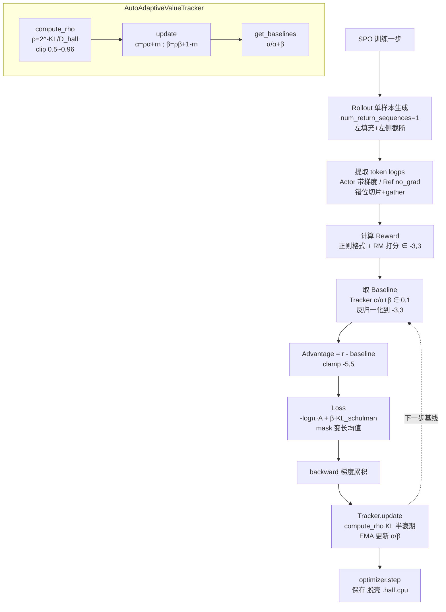

# 算法:Minimind 的 SPO

## 一句话精炼
SPO 用一个纯数学的"指数移动平均 + Beta 分布"历史基线追踪器（`AutoAdaptiveValueTracker`）替代 PPO 的 Critic 神经网络，同时像 PPO 一样每条 Prompt 只采样 1 个回答，从而既省显存又省推理算力，并用"KL 半衰期动态动量 ρ"在数学层面实现策略突变的自动刹车。

## 核心概念（SPO 算法定位与动机；与 PPO/DPO/GRPO 的关系；self-play / 序列级优化等如出现）

- **定位与动机**：SPO（Self-Play Policy Optimization，按 Minimind 代码语境命名，见批判性批注）是 PPO 与 GRPO 之间的"折中派"。
  - PPO：Actor + Critic + Reference + Reward 四模型，显存极贵。
  - GRPO：去掉 Critic，但依赖组内采样（每个 Prompt 生成 4~8 个回答）做相对优势，推理算力成倍上升。
  - SPO：既不要 Critic（省显存），又只对每条 Prompt 采样 1 个回答（省算力），用一个标量数学追踪器把"历史平均分"当 Baseline。
- **Baseline 来源对比**：
  - PPO → 神经网络（Critic）猜价值。
  - GRPO → 组内多人平均分。
  - SPO → `AutoAdaptiveValueTracker` 维护的 Beta 分布期望值 α/(α+β)。
- **稳定机制对比**：
  - PPO 用 `torch.clamp` / clip-range 硬截断。
  - SPO 用"KL 半衰期动态动量 ρ"做自适应遗忘/保留，策略剧变时历史权重自动腰斩，基线快速跟上，从而在数学上"踩刹车"，声称不需要硬 clip 即可稳定训练（见批判性批注）。
- **self-play / 序列级**：Minimind 代码里的 SPO 是"单样本 + 全局历史基线"的序列级策略梯度，并非真正的 self-play 对抗博弈；"Self-Play"更多体现在"用自己过去的平均分当对手"的语义包装上（存疑，见批注）。优势是**序列级**（每条回答一个 Advantage 标量），再通过 `unsqueeze(1)` 广播到 token 级。

## 关键公式（LaTeX:SPO 的目标函数、与 GRPO 的差异项）

**基线（Beta 分布期望）**
$$
\text{Baseline} = \frac{\alpha}{\alpha + \beta}
$$

**动量 ρ 的动态半衰期衰减（核心刹车）**
$$
\rho = \mathrm{clip}\left(2^{-\,\text{KL}/D_{half}},\ \rho_{lower},\ \rho_{upper}\right), \quad \text{KL} = \left|\text{old\_mean\_logprob} - \text{cur\_mean\_logprob}\right|
$$
- 默认 $D_{half}=0.06$：当 KL 恰为 0.06 时 $\rho=2^{-1}=0.5$。
- $\rho_{lower}=0.5$（防失忆），$\rho_{upper}=0.96$（防冻结，保证至少 4% 新经验进入）。

**EMA 更新 α/β（伪计数 N\_init = 1/(1-clip\_lower)=2）**
$$
\alpha_{new} = \rho\,\alpha_{old} + \bar r_{norm}, \qquad \beta_{new} = \rho\,\beta_{old} + (1 - \bar r_{norm})
$$
其中 $\bar r_{norm}$ 为本 batch 归一化奖励均值，奖励归一化 $\in[0,1]$：$r_{norm}=(r+3)/(2\cdot 3)$。

**优势估计（与 GRPO 的关键差异）**
$$
A = r - \text{Baseline}_{denorm}, \quad \text{Baseline}_{denorm} = \text{Baseline}\cdot 2\cdot scale - scale
$$
- GRPO：$A_i = r_i - \bar r_{group}$（组内相对，依赖多样本）。
- SPO：$A_i = r_i - \text{全局历史 EMA 基线}$（依赖单样本 + 历史统计），这正是"去 Critic 且去 Group Sampling"的代价。

**token 级 KL（Schulman 正定估计器）**
$$
\text{KL}_{token} = \exp(\Delta) - \Delta - 1, \quad \Delta = \log\pi_{ref} - \log\pi_{\theta}
$$

**最终策略梯度 Loss**
$$
L_{policy} = \frac{1}{B}\sum_{b}\frac{\sum_{t}\left[-\log\pi_{\theta}(a_{t})\cdot A + \beta\, \text{KL}_{token}\right]\cdot m_{t}}{\sum_{t} m_{t}}
$$
- 第一项为带负号的策略梯度（最大化 $\log\pi\cdot A$）；
- 第二项为 KL 惩罚（防 reward hacking），$\beta$ 通常取 0.02 量级。
- 序列级 Advantage 通过 `advantages.unsqueeze(1)` 广播到该句所有 token。

## 关键算法/流程（SPO 训练流程、采样/配对/优化方式）

1. **Rollout（单样本生成）**
   - `tokenizer(padding_side="left")`：左填充保证自回归末尾对齐。
   - `prompt_inputs[:, -max_seq_len:]`：左侧截断防 OOM，保留靠近生成位的上下文。
   - `model.generate(num_return_sequences=1, do_sample=True, temperature=0.8)`：**每条 Prompt 只生成 1 个回答**，与 GRPO 的多采样不同。
   - 切片 `completion_ids = outputs[:, P:]` 丢弃 Prompt，仅保留 Response。

2. **提取 token 级对数概率**
   - `get_per_token_logps`：前向得 logits，`[:, :-1, :]` 错位丢弃最后一个预测（对齐位置）。
   - `log_softmax` + `torch.gather`：按实际生成的 token id 从词表分布里"查字典"抠出该 token 的 $\log\pi$。
   - Actor 模型带梯度（`autocast_ctx`，无 `no_grad`）；Ref 模型 `torch.no_grad()`。MoE 额外前向取 `aux_loss`。

3. **计算优势**
   - `calculate_rewards`：正则检查格式（`<think>`/`<answer>`）+ 外部 Reward Model 打分，$r\in[-3,3]$。
   - `value_tracker.get_baselines(B)` 取 Beta 期望 $\in[0,1]$，反归一化回 $[-3,3]$。
   - $A = r - \text{baseline}_{denorm}$，再 `clamp(-5, 5)` 防梯度爆炸。

4. **构造掩码**
   - `is_eos` → `argmax` 找第一个 EOS 位置，无 EOS 则默认末尾。
   - 广播 `arange <= eos_idx` 生成 `[B,R]` 的 0/1 mask，剔除 EOS 之后的 pad。

5. **Loss + 反向传播**
   - `kl_div = ref - actor`；`per_token_kl = exp(kl_div) - kl_div - 1`（Schulman 估计器，恒正）。
   - `per_token_loss = -per_token_logps * advantages.unsqueeze(1) + beta * per_token_kl`。
   - `(per_token_loss * mask).sum(1) / mask.sum(1)` 变长序列求均值，再 `.mean()` 得标量。
   - `+ aux_loss`，`/ accumulation_steps` 梯度累积，`backward()`。

6. **更新 Tracker（关键时序）**
   - 反向传播后调用 `value_tracker.update(rewards, per_token_logps.detach(), response_masks)`。
   - `.detach()` 必须有：Tracker 不参与梯度图。
   - 内部：算 `mean_logprob` → `compute_rho` → EMA 更新 α/β，并把当前 `mean_logprob` 存为 `old_mean_logprob` 供下一 batch 算 KL。

7. **收尾**
   - 每 `accumulation_steps` 步：`clip_grad_norm_` + `optimizer.step()` + `scheduler.step()` + `zero_grad()`。
   - 日志上报 `policy_loss / reward / kl / rho / baseline`。
   - 保存：剥离 DDP(`.module`) 与 `torch.compile`(`_orig_mod`)，`state_dict` 转 `.half().cpu()` 存盘 + `lm_checkpoint` 存优化器状态。
   - `del` 中间张量释放显存（同时驻留 Actor/Ref/Reward 三模型）。

## 源码要点（Minimind SPO 代码要点）

- **`AutoAdaptiveValueTracker` 类**
  - 初始化：`rho_mode='kl'`、`rho_const=0.9`、`D_half=0.06`、`clip_lower=0.5`、`clip_upper=0.96`；伪计数 `N_init=2`，`alpha=beta=1.0`，`old_mean_logprob=None`。
  - `compute_rho(cur_mean_logprob)`：冷启动返回 `rho_const`；否则 `kl=abs(old-cur)`，`rho=2**(-kl/D_half)`，再 `max(min(rho,0.96),0.5)`。
  - `update(rewards, cur_logprobs, response_masks)`：
    - `mean_logprob = (cur_logprobs*mask).sum()/mask.sum()`（仅 Response 部分，屏蔽 Prompt/pad）。
    - 奖励归一化 `scale=3.0`，`(r+3)/6`。
    - `alpha = rho*alpha + avg_norm_reward`；`beta = rho*beta + (1-avg_norm_reward)`；返回 `rho`。
  - `get_baselines(n)`：返回 `alpha/(alpha+beta)` 复制 n 份。

- **`spo_train_epoch` 关键点**
  - `num_return_sequences=1`（区别 GRPO 的核心）。
  - `get_per_token_logps`：`logits_to_keep=n_keep+1` 显存优化 + `[:,:,:-1]` 错位 + `gather` 取实际 token 概率。
  - 优势是**序列级标量** `advantages.unsqueeze(1)` 广播到 token。
  - KL 用 `exp(kl_div)-kl_div-1`（Schulman 正定估计），而非平方差。
  - Loss = 序列平均（变长 mask 处理）后 batch 平均 + `aux_loss`，再 `/accumulation_steps`。
  - Tracker 更新在 `backward()` 之后、下一步之前；传入 `per_token_logps.detach()`。
  - 保存"剥洋葱"：`.module`（DDP）→ `_orig_mod`（compile）→ `.half().cpu()`。

## 作者独到见解/类比

- "既像 GRPO 不要 Critic（省显存），又像 PPO 只采 1 个回答（省算力）"——一句话定位 SPO 的生态位。
- 把 `AutoAdaptiveValueTracker` 比作"全局平均分档案"，把 ρ 的动态衰减比作"踩刹车"：策略剧变时历史分已失效，调低 ρ 让基线快速吸收新分，优势变小，梯度被自然拉回。
- "伪计数 N\_init=2"类比为"训练前虚构地观察了 2 个样本"，防前几个 batch 把基线带偏。
- `clip_upper=0.96` 的解释很有味道：即使模型没变化（KL=0），也强制保留 4% 新经验，否则基线会"彻底冻结"，永远不学新知识。
- 强调 SPO "不需要 `torch.clamp` 也能稳定训练"——认为动态 ρ 取代了 PPO 的硬截断。这是作者的核心论点，但需谨慎对待（见批注）。

## 面试考点（SPO 新在哪、为何提出、相对 GRPO 的改进）

1. **新在哪**：用纯数学的 EMA + Beta 分布追踪器替代 Critic 神经网络，Baseline = α/(α+β)。
2. **为何提出**：PPO 显存贵（四模型），GRPO 算力贵（多样本采样）；SPO 同时压缩两者。
3. **相对 GRPO 的改进**：去掉组内多样本采样（`num_return_sequences=1`），推理成本降为 1/N；用全局历史基线替代组内均值。
4. **ρ 的物理意义**：KL 半衰期，KL 越大 ρ 越小，历史权重自动衰减，防基线与模型实际能力脱节。
5. **上下限 clip 的作用**：上 0.96 防冻结，下 0.5 防失忆。
6. **KL 估计器**：`exp(Δ)-Δ-1`（Schulman）恒正，比平方差更贴合概率分布差异。
7. **变长序列求均值**：`(loss*mask).sum(1)/mask.sum(1)` 而非直接 `.mean()`，避免短句被稀释。
8. **冷启动**：首步无 `old_mean_logprob`，返回 `rho_const=0.9`。
9. **工程细节**：左填充、左侧截断、DDP 解包、`_orig_mod` 解 compile、`.detach()` 传 Tracker、梯度累积。
10. **reward hacking 防线**：Ref 模型 KL 惩罚 + ρ 刹车 + `advantages.clamp(-5,5)`。

## 批判性批注（注意:SPO 是很新算法,核对作者描述是否准确,标注任何存疑处）

> **重要声明**：本文仅基于 Minimind 仓库内的 SPO 代码与该作者文档。SPO 作为"很新的算法"，公开论文与权威基准尚不充分，以下为存疑点，建议读者自行核对。

1. **"SPO"命名存疑（高优）**：业界更知名的 SPO 通常指 Self-Play fPO / Sequence Preference Optimization 等；Minimind 代码里的实现更像"单样本 REINFORCE + EMA baseline + KL 正则"，是否为同名算法的简化工程实现，需核对原文。作者文中也只用一句话"SPO 的核心特点..."，未给出正式定义或引用。
2. **"不需要 torch.clamp 也能稳定"**：与代码矛盾。`advantages.clamp(-5.0, 5.0)` 仍是硬截断；ρ 的上下限 `clip_lower/clip_upper` 本质也是 clamp。更准确说法应是"用动态 ρ 替代 PPO 的 ratio clip-range，但仍保留 advantage clamp 作为安全网"。
3. **"单标量 KL 近似"可靠性**：`KL=|old_mean_logprob - cur_mean_logprob|` 是对真实 KL 的极粗近似（只比平均对数概率的绝对差），与 Schulman token 级 KL 不是一回事，作者称其为"简化的单标量 KL 散度"但未说明误差量级，对 ρ 的动态调节可能不稳。
4. **"Beta 分布"是否真正被用**：代码只用了 Beta 的期望 α/(α+β) 与更新式，并未做 Beta 采样或后验推断；更像"用 Beta 的两个参数当 EMA 计数器"。称"底层使用 Beta 分布逻辑"略有过度解读，实际是 EMA 加权和。
5. **序列级优势的方差**：单样本 + 全局基线，Advantage 估计方差远大于 GRPO 组内相对优势，作者未讨论 variance 问题；ρ 自适应能否真正补偿方差存疑。
6. **"self-play"语义**：文中无真正 self-play 对抗生成（如两个策略互博），仅"自己的历史平均分当对手"，命名与实质有出入。
7. **`rho_const=0.9` 与 `clip_lower=0.5` 冲突表述**：作者说"训练第一步默认给历史 90% 权重"，但 `clip_lower=0.5` 是 ρ 的下限；冷启动返回的是 `rho_const` 而非 clip 后的值，表述无错但易混淆。
8. **奖励范围假设**：硬编码 `scale=3.0`，假设 reward∈[-3,3]；不同 Reward Model 量纲不同，迁移性存疑，作者未提示。
9. **`torch.exp(kl_div) - kl_div - 1` 方向**：`kl_div = ref - actor`，Schulman 估计器对方向不敏感（恒正），代码正确；但作者解释"无论概率变大变小都惩罚"成立，无误。
10. **与 GRPO 比较的公平性**：GRPO 的组内采样同时提供方差更低的优势估计，SPO 用历史 EMA 换算力，但基线滞后性可能引入偏差，作者未做对照实验数据支撑"既省又稳"的结论。

总体判断：作者对 Minimind 代码的工程细节（左填充、错位切片、gather、mask、DDP 剥壳等）讲解准确且精彩；对 SPO 算法层面的"创新性"描述偏宣传化，建议读者把它当作"REINFORCE + EMA baseline + KL 正则"的工程实现来理解，而非已定论的新算法。

## 篇内小思维导图（mermaid 或缩进树）

