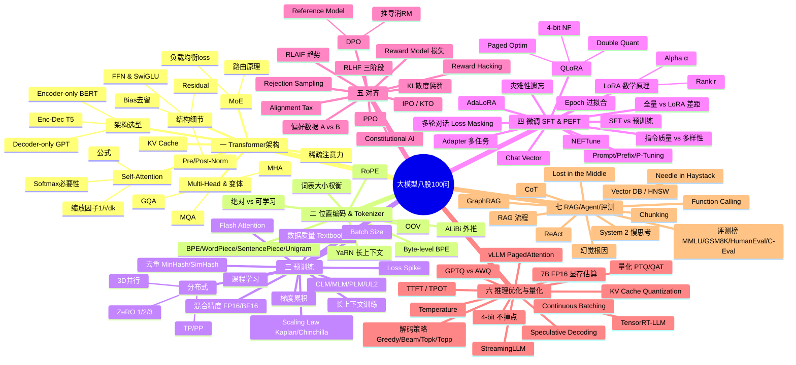

# 求职:大模型八股 100 问

## 一句话精炼

作者按 7 大板块（Transformer 架构 / 位置编码与 Tokenizer / 预训练 / 微调 / 对齐 / 推理优化 / RAG·Agent·评测）罗列了约 100 道大模型面试高频题，纯题目列表无答案，主旨是"成体系理解 + 项目实践 > 死磕八股"。

## 问题分类统计(按主题归簇)

文件实际共 **100 题**（第 7 部分标题写 89-100，但该部分内仅列 12 题，与 1-100 计数一致）。按板块归簇的数量分布如下：

| 板块 | 题号 | 题数 | 占比 |
|------|------|------|------|
| 一、Transformer 基础架构 | 1-20 | 20 | 20% |
| 二、位置编码与 Tokenizer | 21-30 | 10 | 10% |
| 三、预训练 Pre-training | 31-45 | 15 | 15% |
| 四、微调 SFT & PEFT | 46-60 | 15 | 15% |
| 五、对齐 Alignment (RLHF & DPO) | 61-75 | 15 | 15% |
| 六、推理优化与量化 | 76-88 | 13 | 13% |
| 七、RAG、Agent 与评测 | 89-100 | 12 | 12% |

分布观察：架构(20)是最大头，对齐(15)+微调(15)+预训练(15) 三者并列构成"训练侧"主轴（合计 45%），推理优化(13)体现工程落地，应用层 RAG/Agent/评测(12) 偏薄。整体重心明显偏向**算法原理与训练侧**，工程部署与 Agent 工程链路占比偏低。

## 高频考点 TOP 列表(摘录最有代表性的 15-20 个问题原文)

1. 请手写或详细描述 **Self-Attention** 的计算公式及物理含义。
2. Layer Norm 在 Transformer 中是 Pre-Norm 还是 Post-Norm？在大模型（如 Llama 2/3）中通常用哪种？为什么？
3. 引入 SwiGLU 激活函数有什么优势？
4. 为什么现在的 LLM 大多选择 **Decoder-only** 架构？
5. 讲一下 **GQA (Grouped Query Attention)** 和 **MQA (Multi-Query Attention)** 的区别及其对性能/显存的影响。
6. 解释一下 **KV Cache** 的原理。为什么它能加速推理？它会带来显存占用的问题吗？
7. 解释 **DeepSeek** 或 **Mixtral** 使用的 **MoE (Mixture of Experts)** 架构原理。
8. 什么是 **RoPE (Rotary Positional Embedding)**？它是如何利用复数运算实现相对位置信息的？
9. 解释 **Scaling Laws** (Kaplan vs Chinchilla)。在给定算力预算下，如何权衡模型参数量和数据量？
10. **混合精度训练** 的原理是什么？FP16 和 BF16 有什么区别？为什么大模型训练推荐用 BF16？
11. 解释 **ZeRO** 的三个阶段（ZeRO-1, 2, 3）。
12. 详细讲解 **LoRA** 的数学原理。
13. **QLoRA** 相比 LoRA 做了哪些改进？
14. 简述 **RLHF** 的三个主要阶段。
15. 详细解释 **PPO** 在 RLHF 中的作用。
16. 什么是 **DPO (Direct Preference Optimization)**？它相比 PPO 有什么优势？DPO 的 Loss Function 推导逻辑简述。
17. 什么是 **Speculative Decoding (投机采样/推测解码)**？原理是什么？
18. **vLLM** 框架的核心技术 **PagedAttention** 是解决了什么问题？
19. 解释 **GPTQ** 和 **AWQ** 的区别。
20. 什么是 **GraphRAG**？知识图谱如何辅助 RAG？

## 答案质量评估

**作者明确不写答案**——这是该文件最关键的特征。原文第 5 行直陈："考虑到篇幅原因，我就不写回答了。看完我的 minimind 详解应该能回答一大部分了，然后有不懂了问问 AI，面试八股就差不多了。"

因此本文档的"答案质量"评估为：
- **存在性**：零答案，纯题目清单。
- **准确度**：不适用（无可校对内容）。
- **可使用性**：题目本身措辞准确、术语规范、板块划分清晰，作为"复习提纲/自测清单"价值高；作为"学习材料"价值低，需要读者自行填答。

价值定位：它是**导览索引**而非**教材**，真正的知识载体被作者外置到"minimind 详解"项目 + AI 问答两条路径。

## 作者独到见解/类比

作者几乎没有技术类比，但有两条值得注意的元观点（均为方法论而非技术）：

1. **反八股立场**："大厂面试看中的核心是你对知识的成体系理解，所以不建议死磕八股，而是通过一个项目的实践，建立你对这个领域的系统性认知。"——即"八股只是地图，项目才是路"。
2. **复习策略分层**：1-20 题与 LoRA 部分"要能手推公式或画架构图"；DPO、MoE、Flash Attention v2、vLLM 列为"加分项"。这暗示作者认为**可推导的硬核原理 + 前沿工程热点**才是面试分水岭，死记概念不划算。
3. （隐含）**板块编排本身就是一种见解**：把对齐(Alignment)单独成节并标注"高阶考点"，把推理优化标注"工程落地必问"——这两个标签比题目本身更能指导备战优先级。

## 面试考点(本身就是面试题,提炼出最值得准备的几类)

从这 100 题中抽取出最值得投入准备精力的考点簇（按 ROI 排序）：

1. **Transformer 内核可推导类**：Self-Attention 公式、缩放因子 1/√d_k、Softmax 必要性、残差连接、Pre/Post-Norm 选择 —— 面试官最爱让"手推"的一组。
2. **现代 LLM 架构选型类**：Decoder-only 为何胜出、SwiGLU、RoPE、GQA/MQA、RMSNorm、去 Bias —— Llama 系技术栈全貌。
3. **训练分布式类**：ZeRO 1/2/3、3D 并行 (DP+TP+PP)、混合精度 FP16 vs BF16、梯度累积 —— 大规模训练工程面试核心。
4. **PEFT 参数高效微调类**：LoRA 数学原理、r/α 选择、QLoRA 四件套、Prompt/Prefix/P-Tuning 区分 —— 实际工作最高频。
5. **对齐算法类**：RLHF 三阶段、RM 损失、PPO、KL 散度惩罚、DPO 推导、IPO/KTO、Constitutional AI —— 算法岗分水岭。
6. **推理工程类**：KV Cache、Speculative Decoding、PagedAttention、Continuous Batching、TTFT/TPOT、GPTQ vs AWQ —— 部署岗必问。
7. **应用与评测类**：RAG 流程与 Lost-in-the-Middle、GraphRAG、HNSW、CoT/ReAct、Function Calling、Needle-in-Haystack —— 业务岗收尾题。

## 批判性批注

**A. 过时 / 已被超越的点**

- **Chinchilla scaling law 仍是默认**（第 31 题）：2024 年起 Llama-3、DeepSeek-V3 等实证"过度训练"（data multiple 远超 20x Chinchilla 最优）反而更经济，Kaplan vs Chinchilla 二分已不足以描述现状，需补 "compute-optimal vs. over-training" 的最新讨论。
- **第 75 题"RLHF vs RLAIF 趋势"**：2026 视角下，主流已转向 **GRPO / DAPO / RLVR**（verifiable-reward RL，DeepSeek-R1、Qwen3 系）以及 self-reward / rule-based reward，纯 pairwise human/AI feedback 的"经典 RLHF/DPO"叙事明显退潮，本题应升级为"verifiable reward vs preference reward 之争"。
- **第 65 题"Batch Size 对收敛影响"**：在 muP / max LR scheduler / scheduler-free 等新范式下，单纯讨论 batch size 已不完整，需结合 LR–scale 协同。
- **第 72 题"LLM → System 2"**：2025 年 o1/o3、DeepSeek-R1、Claude 4 reasoning 模型已让"慢思考"从展望变为产品形态，本题的"看法"属性应转为"test-time scaling 实现机制（CoT 长度奖励/RLVR）"。
- **评测榜单**（第 96 题 MMLU/GSM8K/HumanEval/C-Eval）：2026 年这些榜单普遍污染 + 饱和，主流已转向 MMLU-Pro、GPQA-Diamond、AIME、LiveCodeBench、SWE-bench、HLE 等，原榜仅作背景。

**B. 缺失 / 该补而未补的题**

- **缺少多模态专章**：ViT 只在 1-20 收一题，CLIP/LLaVA/VLM 对齐、token 压缩、视频流式几乎未涉及——而多模态已是 2025-2026 必考点。
- **缺少 Agent 工程链路**：ReAct 一题不足以覆盖 2026 的 tool-use / planning / multi-agent / context-engineering / computer-use。
- **缺少长上下文召回机制**：YaRN 在第 42 题出现，但缺 RingAttention、Native Sparse Attention、MoBA、Mamba/hybrid SSM 等 2025 热门。
- **缺少安全/对齐安全**：无 jailbreak 防御、constitutional 之外的红队、reward hacking 只一题且偏理论。

**C. 可能误导的点**

- **作者外置答案到"minimind 详解 + 问 AI"**：2026 年用通用 AI 问答填八股风险是 AI 会给出**过时答案**（尤其对齐、scaling law、评测榜），读者需自带"时间戳"意识交叉验证。
- **"加分项"清单**（DPO/MoE/Flash Attn v2/vLLM）在 2026 已属**标配**而非加分项，继续按"加分"准备会低估预期。

## 簇内小思维导图

